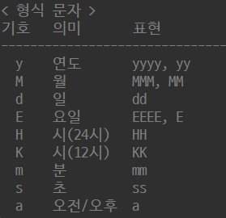

> 기본 데이터 타입 (Primitive Type) 

<br>

byte (1Byte = 8bit) : 2<sup>8</sup> = 256 = -128 ~ +127 

short (2Byte = 16bit) : 2<sup>16</sup> = 65536 = -32768 ~ +32767 

int (4Byte = 32bit) : 2<sup>32</sup> = 약 -21억 ~ +21억, 정수의 기본형 

long (8Byte = 64bit) : 2<sup>64</sup> = 약 -922경 ~ +922경

 <br>

2진수 : 0, 1 사용, 접두사 0b

8진수 : 0 ~ 7 사용, 접두사 0

16진수 : 0 ~ 9, A ~ F(10 ~ 15) 사용, 접두사 0x

<br>

char : 정수형 데이터로 처리, 0~65535 값 가짐

&nbsp;&nbsp;&nbsp;&nbsp;&nbsp;&nbsp;&nbsp;&nbsp;&nbsp;&nbsp;&nbsp;유니코드 표현 방법 사용 \uXXXX

ASCII : 미국 표준 문자 코드 

&nbsp;&nbsp;&nbsp;&nbsp;&nbsp;&nbsp;&nbsp;&nbsp;&nbsp;&nbsp;&nbsp;'A' = 65, 'a' = 97, '0' = 48

<br>

> 자동 형변환

작은 데이터 타입 → 큰 데이터 타입

자바 컴파일러에 의해 자동으로 형변환

byte < short < int < long < float < double

char → int, long, float, double 자동 형변환 가능

(      char      )

<br>

> 강제 형변환

큰 데이터 타입 → 작은 데이터 타입

오버플로우 발생 가능

char ←→ byte, short 강제 형변환 필수

```java
int i = 100;
double d = 3.14;
//작은 데이터 타입 = (작은 데이터 타입) 큰 데이터 타입;
i = (int)d; //3 저장됨 (오버플로우)

byte b = 100;
char ch = (char)b;
```

<br>

> 산술 연산 형변환

피연산자끼리 데이터 타입을 일치시킨 후 연산 수행

int 보다 작은 타입 (byte, short, char) 끼리의 연산은 모두 int 타입으로 변환 후 연산

int 보다 큰 타입 (long, float, double)과의 연산은 큰 타입으로 변환 후 연산

→ 결과값 데이터는 큰 타입이 됨

리터럴 연산시에는 자동 형변환이 일어나지 않음

```java
byte b1 = 10;
byte b2 = 20;
//byte + byte = int + int = int
//int형 데이터를 byte 변수에 저장 → 오류
byte b3 = b1 + b2; 

//1. 연산 결과를 강제 형변환
byte b3 = (byte)(b1 + b2);
//2. 연산 결과와 같은 데이터 타입 변수에 저장
int b3 = b1 + b2;

byte b4 = 10 + 20; //리터럴 연산

//===============================================================

float f = 0.1f;
double d = 0.1;
//float + double = double + double = double 
//근사치 표현에 의해 잘못된 결과 발생 가능성

//1. double→float 강제 형변환 후 연산
System.out.println(f + (float)d);
//2. 두 실수를 정수 변환하여 연산 수행 후 실수로 변환
System.out.println(((int)(f * 10) + (int)(d * 10)) / 10.0);
```

<br>

> 연결 연산자 +

문자열 + 문자열 = 문자열문자열

문자열 + 숫자 = 문자열숫자

문자열 + 숫자 + 숫자 = 문자열숫자숫자

숫자 + 문자열 = 숫자문자열

숫자 + 숫자 + 문자열 = 산술연산된숫자문자열

<br>

> 확장 대입 연산자

+=   -=   *=   /=   %=

```java
char ch = 'A';

ch = ch + 3; //에러

//1. 강제형변환
ch = (char)(ch + 3)
//2. 확장대입연산자 사용
ch += 3;
```

<br>

> 비교 연산자

==  !=  >   >=   <   <=

true / false 리턴

```java
//char 타입끼리 비교 시 int 타입으로 변환 후 유니코드 값 비교
System.out.println('A' > 'B'); //false
System.out.println('A' == 65); //true

//double 타입과 float 타입 비교 시 실수 근사치 표현에 의해 잘못된 연산 결과 발생 가능
System.out.println(0.1 == 0.1f); //false
System.out.println((float)0.1 == 0.1f) //true
```

<br>

> 논리 연산자

&&  ||  ^   !

true / false 리턴

<br>

<br>

> 증감 연산자

해당 피연산자 값을 1만큼 증가 / 감소

- 선행연산자 (전위연산자) ++a / --a

  피연산자의 값을 먼저 증감시킨 후 다른 연산 수행

- 후행연산자 (후위연산자) a++ / a--

  다른 연산 수행 후 피연산자의 값 증감

<br>

> 삼항 연산자 (조건 연산자)

피연산자가 3개

조건식 ? 값1(true) : 값2(false);

<br>

> 조건문 if

```java
//다중if문
if(조건식1) {
	//조건식1 true
} else if(조건식2) {
	//조건식1 false, 조건식2 true
} else {
	//조건식1,2 false
}

//중첩if문
if(조건식1) {
    if(조건식2) {
        //조건식1,2 true 
    } else {
        //조건식1 true, 조건식2 false
    }
} else {
    //조건식1 false
}
```

<br>

> 조건문 switch

값에 대한 동등 비교만 가능

break문을 만나면 switch문을 빠져나감

break문이 없으면 break문을 만나거나 switch문이 종료될때까지 아래 모든 실행문 수행

조건식 연산 결과 : 정수 / 문자열 타입

```java
switch(조건식) {
	case 값1 :
		//조건식 결과 = 값1
		[break;]
	case 값2 :
		//조건식 결과 = 값2
		[break;]
	[default : //일치하는 값이 없을 경우 ]
}
```

<br>

> 반복문 for

반복 횟수가 정해져 있는 경우

```java
for(초기식; 조건식; 증감식) {
	//조건식 결과가 true일때 반복 실행
}
```

<br>

> 반복문 while

```java
//while문
while(조건식) {
	//조건식 결과가 true일때 반복 실행
}

//do~while문
//일단 반복문을 실행한 후 조건 검사
do {
    //반복 실행
} while(조건식);
```

break : 반복문을 종료하는 용도

continue : 반복문의 다음 문장 실행을 생략하고 다음 반복 진행

<br>

> Label

반복문 앞에 위치

break / continue 동작 지점 지정

중첩 반복문에서 반복문을 한꺼번에 빠져나가기 위해 사용

```java
LABELNAME:
반복문() {
	반복문() {
		if(조건식) {
			continue LABELNAME;
		}
        if(조건식) {
		break LABELNAME;
		}
    }
}
```

<br>

> 비트 단위 

- 논리 연산자  &   |   ~    ^

  정수에 대한 2진수 연산 수행

- 쉬프트 연산자  <<   >>

  - n << x 

    2진수 비트를 좌측으로 x 비트만큼 이동

    맨 좌측에서 탈락하는 비트는 맨 우측으로 이동됨

    연산 결과 = n * 2<sup>x 

  - n >> x

    2진수 비트를 우측으로 x 비트만큼 이동

    맨 우측에서 탈락하는 비트는 버려짐

    연산 결과 = n * (1/2)<sup>x 

<br>

> 배열

같은 타입 데이터만 저장 가능

메모리 공간이 연속된 공간에 차례대로 생성

인덱스 자동 부여, 0~(배열크기-1) 

한번 생성된 배열은 크기 변경 불가

배열 데이터 타입 기본값으로 자동 초기화

byte, short, int → 0

long → 0L, float → 0.0f, double → 0.0

char → \u0000, 0 

boolean → false

String → null

```java
//데이터타입[] 변수명 = {데이터1, 데이터2, …, 데이터n};
int[] arr = {1, 2, 3, 4, 5};

//데이터타입[] 변수명;
int[] arr;
//변수명 = new 데이터타입[배열크기];
arr = new int[5];
//초기화
arr = new int[]{1, 2, 3, 4, 5};
```

<br>

> 2차원 배열

행을 먼저 생성한 후 별도로 열 생성 가능

행 크기 : 변수명.length

열 크기 : 변수명[행 인덱스].length

```java
/*
데이터타입[][] 변수명 = {
    {데이터1, 데이터2, …, 데이터n}, //0행
	            …		
	{데이터1, 데이터2, …, 데이터n}  //m행
};
*/

//데이터타입[][] 변수명 = new 데이터타입[행크기][열크기];
int[][] arr = new int[3][];
arr[0] = new int[3];
arr[1] = new int[2];
arr[2] = new int[4];

for(int i=0; i<arr.length; i++) {
    for(int j=0; j<arr[i].length; j++) {
    	System.out.print(arr[i][j] + " ");
    }
    System.out.println();
}
```

<br>

> 메서드 Method

호출되어야만 실행, 작업 수행 후 호출 위치로 되돌아감

main() 메서드는 프로그램 실행 시점에서 자동으로 호출됨

전달인자(Argument) : 메서드에 전달하는 값

매개변수(Parameter) : 전달인자를 전달받아 저장하는 변수

메서드 호출 시 매개변수와 일치하는 타입과 개수의 데이터 전달 필수

리턴값 : 호출한 곳으로 전달하는 값

리턴타입을 명시한 경우 반드시 return문을 사용

→ 리턴타입 void인 경우 생략 가능, 리턴값 없이 return; 만 기술

```java
//메서드 정의
[접근제한자] 리턴타입 메서드명([매개변수…]) {
	//수행할 코드
	[return [리턴값];]
}

//메서드 호출
//1.리턴값이 없는 경우
메서드명([데이터…]);
//2. 리턴값이 있는 경우
데이터타입 변수명 = 메서드명([데이터…]); //변수에 저장
System.out.println(메서드명([데이터…])); //출력
```

<br>

> 클래스 Class

하나의 java 파일 내에 여러 클래스 정의 가능

파일명과 동일한 이름의 클래스 외에는 public 키워드 사용 불가

인스턴스(Instance) : 클래스를 사용하여 메모리에 생성된 객체

인스턴스의 주소를 담고 있는 참조변수를 통해 클래스 멤버변수, 메서드 호출

```java
//클래스 정의
[접근제한자] class 클래스명 {
	//멤버변수 선언
	//생성자 정의
	//메서드 정의
}

//인스턴스 생성
클래스명 변수명 = new 생성자명([데이터…]);
변수명.멤버변수 = "초기화할 값";
변수명.메서드();
```

<br>

> 접근제한자

(넓음) public > protected > default > private (좁음)

- private

  외부 클래스에서 접근(값 변경) 불가

  자신의 클래스 내에서만 접근 가능

- default

  접근제한자를 생략할 경우 적용, 기본 접근제한자

  같은 패키지에서만 접근 가능

- protected

  같은 패키지, 다른 패키지의 서브클래스에서 접근 가능

  서브클래스에서 슈퍼클래스의 인스턴스 생성 후 참조변수를 통한 접근 

  → is - a (상속) 관계가 아닌 has - a (포함) 관계로 취급되므로 protected 접근 불가

- public

  모든 패키지, 모든 클래스에서 접근 가능

<br>

> Getter / Setter

클래스 내에서 private 접근제한자로 선언된 멤버변수 등에 접근하기 위해 클래스 내에서 제공하는 메서드

public 접근제한자 사용

`Alt` `Shift` `S` + `R`

- Getter 

  내부 멤버변수의 값을 외부로 리턴

  파라미터 X, 리턴값 O

  getXXX() 형식의 이름 정의, 접근할 멤버변수 이름 사용

- Setter

  외부로부터 값을 전달받아 내부 멤버변수에 저장

  파라미터 O, 리턴값 X

  setXXX() 형식의 이름 정의, 접근할 멤버변수 이름 사용

```java
public class Person {
	private String name;
	//Getter
	public String getName() {
		return name;
	}
	//Setter
	public void setName(String name) {
		this.name = name;
	}
}
```

<br>

> 생성자 Constructor

클래스를 사용하여 인스턴스를 생성할 때 호출

별도 호출 불가, new 키워드 뒤에서만 사용 가능

선언부에 리턴타입 기술 X, 클래스 이름과 동일

클래스 정의 시 생성자를 정의하지 않으면 컴파일러에 의해 자동으로 기본 생성자가 생성됨

→ 파라미터 생성자를 하나라도 정의할 경우 기본 생성자 자동 생성 X

- 기본 생성자 

  클래스와 접근제한자가 같음

  매개변수 없음

  수행할 코드 없음

- 파라미터 생성자

  생성자 호출 시점에 전달해야할 데이터가 있는 경우 → 인스턴스 변수 초기화

  객체마다 다른 데이터를 가진 인스턴스 생성

  `Alt` `Shift` `S` + `O`

```java
//기본 생성자
[접근제한자] 클래스명() {}

//파라미터 생성자
[접근제한자] 클래스명([매개변수…]) {
    인스턴스변수명 = 데이터; //초기화
}
```

<br>

> 메서드 오버로딩 Method Overloading

동일한 이름, 다른 파라미터의 메서드를 여러번 정의

메서드 이름, 리턴타입, 접근제한자 동일하게 정의

전달되는 데이터(파라미터)만으로 각 메서드가 구분됨

```java
public void add(int num1, int num2) {
	System.out.println(num1 + num2);
}
//파라미터 데이터 타입이 다름
public void add(double num1, double num2) {
    System.out.println(num1 + num2);
}
//파라미터 갯수가 다름
public void add(int num1, int num2, int num3) {
    System.out.println(num1 + num2 + num3);
}
```


<br>

> 생성자 오버로딩 Constructor Overloading

생성자 호출 시 다양한 형태의 파라미터를 전달하여 객체를 다양하게 초기화

```java
public Person() {}

public Person(String name, String ssn) {
    this.Person("대한민국", name, ssn); //코드의 재사용
}

public Person(String nation, String name, String ssn) {
	this.nation = nation;
    this.name = name;
    this.ssn = ssn;
}
```

<br>

> 키워드 this 

자신의 인스턴스 주소값을 저장하는 참조 변수 (자바에 의해 자동 생성)

모든 인스턴스 내에 this 존재

- 레퍼런스 this

  자신의 인스턴스 내의 멤버변수 / 멤버메서드에 접근

  자신의 클래스 내의 생성자 / 메서드 내에서 this.멤버변수 / this.메서드() 형태로 접근

  로컬변수와 인스턴스(멤버)변수의 이름이 같을 때 인스턴스 변수를 지정하는 용도

- 생성자 this

  자신의 생성자 내에서 자신의 또 다른 생성자를 호출

  자신의 인스턴스에 접근하여 다른 오버로딩 생성자를 호출 → 초기화 코드 중복 제거

  생성자 첫번째 라인에서 호출, 다른 실행 코드보다 먼저 실행

<br>

> 가변형 인자 Variable Arguments, VARARGS

메서드 파라미터를 하나의 인자만 사용하여 다양하게 전달받음

동일한 타입의 파라미터를 0 ~ 무한대로 전달받아 배열로 관리

→ 전달받는 데이터의 갯수에 따라 자동으로 배열 생성

데이터 타입 뒤에 `...` 표기

다른 파라미터와 가변 인자 조합 가능

가변인자는 마지막 파라미터로 단 한번만 지정 가능

```java
public void print(String...names) { … }
public void print2(int num, String...names) { … }
```

<br>

> 값 전달 방식

- Pass by value 값에 의한 전달

  메서드 호출 시 기본 데이터타입 데이터를 전달하는 경우

  실제 값을 복사해서 전달

  호출된 메서드 내에서 전달받은 값을 변경해도 원본 데이터에는 영향 X

- Pass by reference 참조에 의한 전달

  메서드 호출 시 참조 데이터타입 데이터를 전달하는 경우

  실제 값이 있는 공간의 주소 값을 복사해서 전달

  호출된 메서드 내에서 전달받은 값에 접근하여 변경하는 경우 원본 데이터에 영향 O

  → 원본 데이터도 동일한 주소값 참조하기 때문

<br>

> 패키지 package

자바의 클래스 파일들을 모아놓는 공간

서로 다른 패키지에서 같은 이름의 다른 클래스 존재 가능

특정 클래스 파일은 하나의 패키지에만 소속됨

클래스명 앞에 패키지명 기술 → 상위패키지명.하위패키지명.클래스명 

클래스 파일 첫 번째 라인에 해당 클래스가 소속된 패키지명 명시 → package 패키지명;

<br>

특정 패키지를 자주 사용하는 경우 import문 사용

- import 패키지명.클래스명; 

- import 패키지명.*;
- import [패키지명.]클래스명; (같은 패키지일 때 생략 가능)

클래스명 대신 * 지정시 해당 패키지 내의 모든 클래스를 포함

java.lang 패키지는 import문 생략 가능

패키지명 보다 아래, 클래스 선언부보다 위에 위치, 여러번 작성 가능

`Ctrl` `Shift` `O`

<br>

> 자바 프로그램 실행 과정

1. 클래스 로딩

   static 변수 및 메서드가 메모리에 로딩됨

2. main() 메서드 호출

3. 인스턴스 생성

   인스턴스 변수 및 메서드가 메모리에 로딩됨

4. 인스턴스 메서드 호출

   로컬 변수가 메모리에 로딩됨

5. 결과 출력

6. 프로그램 종료

<br>

> 키워드 static

클래스, 메서드, 변수 제한자

클래스가 로딩되는 시점에 메모리에 로딩됨

(일반 메서드, 변수는 인스턴스가 생성되는 시점에 메모리에 로딩됨)

참조변수(인스턴스 생성) 없이 클래스명만으로 접근 가능

→ 클래스명.변수명 / 클래스.메서드명() 형태로 접근

- static 변수

  클래스(정적) 멤버로 취급됨

  모든 인스턴스에서 하나의 변수를 공유

  클래스 당 하나만 생성됨 (클래스 영역 Method Area에 생성됨)

- static 메서드

  리턴타입 앞에 static 키워드를 붙임

  인스턴스 변수, 메서드 사용 불가 

  → 인스턴스 생성 시점에 로딩되므로 static 메서드 로딩 시점에 존재하지 않음

  레퍼런스 this / super 사용 불가

  → 인스턴스 생성 시점에 로딩되므로 static 메서드 로딩 시점에 존재하지 않음

  → 클래스명.XXX 형식으로 접근

  메서드 오버라이딩 불가

  파라미터, 리턴값 없음

<br>

> 싱글톤 디자인 패턴 Singleton Design Pattern

단 하나의 유일한 인스턴스를 생성하여 공유

외부에서 인스턴스 생성을 하지 못하도록 차단

클래스 내에서 직접 인스턴스를 생성한 후 외부로 리턴

1. 생성자에 private 접근제한자를 선언하여 외부에서 인스턴스 생성이 불가능하게 함

2. 자신의 클래스에서 직접 인스턴스를 생성하여 참조변수에 저장

   → 외부에서 인스턴스 생성 없이 접근 가능하도록 static 키워드 사용

   → 외부에서 접근하지 못하도록 private 접근제한자 선언

3. 생성된 인스턴스를 외부로 리턴하는 Getter 메서드 정의

   → private 접근제한자로 선언된 멤버변수 인스턴스에 접근하여 생성된 인스턴스를 리턴

   → 인스턴스 생성 없이 접근 가능하도록 static 키워드 사용

```java
class SingletonClass {
	//인스턴스 생성
    private static SingletonClass instance = new SingletonClass();
    //기본 생성자 정의
    private SingletonClass() {}
    //Getter 정의
    public static SingletonClass getInstance() {
		return instance;
	}
}
//-----------------------------------------------------------------------
SingletonClass sc = SingletonClass.getInstance();
SingletonClass sc2 = SingletonClass.getInstance();
//두 인스턴스 sc, sc2는 같음
//리턴받은 인스턴스를 통해 멤버변수, 메서드에 접근 가능
```

<br>

> 상속 Inheritance

is - a 관계, 단일 상속

슈퍼클래스의 모든 멤버를 서브클래스에서 물려받아 선언없이 사용

private 접근제한자가 지정된 멤버는 상속 대상에서 제외

생성자는 상속 대상에서 제외 → 자신의 클래스 이름과 생성자 이름이 다르기 때문

서브클래스 생성자 호출 시 슈퍼클래스의 인스턴스를 먼저 생성한 후 서브클래스의 인스턴스가 생성됨

별도로 상속 대상을 지정하지 않은 경우 java.lang.Object 클래스를 자동으로 상속받음

코드 재사용성 증가, 유지보수 용이

```java
class 서브클래스명 extends 슈퍼클래스명 {}
```

<br>

> 포함

has - a 관계

일반적인 객체간의 관계

특정 클래스 내에서 다른 클래스의 인스턴스를 생성하여 해당 인스턴스를 다룸

<br>

> 메서드 오버라이딩 Method Overriding

슈퍼클래스로부터 상속받은 메서드를 서브클래스에서 재정의 @Override

슈퍼클래스의 메서드는 은닉됨

1. 상속 관계 필수

2. 메서드명, 리턴타입, 파라미터 일치해야 함

   → 리턴타입은 슈퍼클래스 / 서브클래스 타입으로 변경 가능

3. 접근제한자는 같거나 넓은 범위로만 변경 가능

`Alt` `Shift` `S` + `V`

<br>

> 키워드 super

오버라이딩 시 슈퍼클래스의 멤버변수와 메서드는 은닉되어 보이지 않음

→ 서브클래스의 인스턴스를 통해 슈퍼클래스 멤버에 접근 불가

메서드 내에서 접근 순서 : 로컬변수 → 멤버변수 → 슈퍼클래스의 멤버변수 → … → Object 멤버변수

- 레퍼런스 super

  은닉된 슈퍼클래스의 멤버에 접근하기 위한 키워드

  서브클래스 인스턴스를 생성할 때 생성됨

  자동으로 생성되는 슈퍼클래스의 인스턴스 주소를 저장하는 변수

  super.슈퍼클래스멤버변수 / super.슈퍼클래스메서드()

- 생성자 super

  서브클래스 인스턴스 생성 시 자동으로 슈퍼클래스 인스턴스를 먼저 생성한 후 서브클래스 인스턴스 생성

  서브클래스 생성자에서 슈퍼클래스 기본생성자를 자동 호출

  슈퍼클래스에 파라미터 생성자만 존재할 경우 서브클래스 생성자에서 컴파일 에러 발생

  슈퍼클래스의 생성자를 명시적으로 호출할 때 사용

  반드시 생성자의 첫 문장에서 실행 → super(), this() 동시 사용 불가

<br>

> 키워드 final

대상의 변경이 불가능하도록 지정

- final 변수

  변수 값 변경 불가

  상수로 취급됨 → 일반 변수와 구별하기 위해 이름을 대문자로 지정, 단어 구분 `_` 사용

  초기화 필수 

  - blank final 상수

    초기화를 수행하지 않은 상수

    생성자를 통해 초기화하여 사용 → 객체마다 다른 상수 값을 가짐

- final 메서드

  오버라이딩 금지

- final 클래스

  상속 금지

```java
class FinalMember {
    
	final int blankFinalMember;
	
	public FinalMember(int blankFinalMember) {
		super();
		this.blankFinalMember = blankFinalMember;
	}
    
}
```

<br>

> 레퍼런스 형변환

어떤 인스턴스를 다른 타입으로 변환하는 것

참조형 데이터타입간의 변환

반드시 상속 관계

슈퍼클래스타입 ←→ 서브클래스타입

업캐스팅

다운캐스팅

<br>

> 업캐스팅 Up Casting

슈퍼클래스 타입 레퍼런스가 서브클래스 인스턴스를 참조

하나의 슈퍼클래스 타입으로 여러 서브클래스 인스턴스 참조 가능

서브클래스의 인스턴스를 슈퍼클래스 타입으로 형변환

컴파일러에 의해 자동 형변환

슈퍼클래스로부터 상속된 멤버만 접근 가능 → 참조 가능한 영역이 축소됨 

```java
//서브클래스 Child → 슈퍼클래스 Parent 타입 형변환
Parent p = new Child();
```

<br>

> 다운캐스팅 Down Casting

서브클래스 타입 레퍼런스가 슈퍼클래스 인스턴스를 참조

슈퍼클래스 인스턴스를 서브클래스 타입으로 형변환

명시적(강제) 형변환 필요

참조 가능한 영역이 확대됨

기본적으로 다운캐스팅은 허용되지 않음 → 존재하지 않는 영역에 대한 참조 위험성

이미 업캐스팅 된 인스턴스를 다시 다운캐스팅하는 경우에만 가능

```java
Child c = new Parent(); //컴파일 오류
Child c = (Child)(new Parent()); //실행 시 다운캐스팅 시점에서 오류

//===================================================================================

Parent p = new Child(); //자동 형변환
Child c = (Child)p; //다운캐스팅
```

<br>

> instanceof

좌변의 객체가 우변의 클래스 타입인지 판별하는 연산자

우변의 클래스 타입과 같거나 그 자식 타입인 경우

A is a B = A instanceof B

true → 형변환 가능

false  → 형변환 불가

```java
if(c instanceof Parent) {
	Parent p = c;
}

if(p instanceof Child) {
    Child c = (Child)p;
}
```

<br>

> 동적 바인딩

상속 관계에서 업캐스팅 후 메서드를 호출할 때

컴파일 단계에서의 실행 대상과 실제 실행 단계에서의 실행 대상이 달라지는 것

<br>

>다형성

하나의 데이터타입(참조변수)으로 여러 인스턴스를 참조하는 특성

인스턴스를 업캐스팅하여 슈퍼클래스 타입 변수로 다루면

하나의 슈퍼클래스 타입으로 여러 서브클래스 타입 인스턴스를 다룰 수 있음

메서드에 다형성 활용

- 이미 다형성이 적용된 배열을 메서드 파라미터로 전달
- 메서드 파라미터로 인스턴스를 전달

<br>

> 추상메서드 Abstract Method

메서드 바디 { }가 존재하지 않음 → 세미콜론

실행코드가 없으므로 호출 될 수 없음

메서드 선언부 접근제한자 뒤에 abstract 키워드

```java
[접근제한자] abstract 리턴타입 메서드명([매개변수…]);
```

<br>

> 추상클래스 Abstract Class

인스턴스를 생성할 수 없음

→ 추상메서드가 호출되면 안되므로 인스턴스 생성을 못하게 차단

상속을 통한 슈퍼클래스로 사용, 다형성 활용을 위한 참조변수 타입으로 사용 가능

추상메서드가 없는 메서드도 추상클래스로 정의할 수 있음

추상메서드를 포함하는 추상클래스를 상속받는 서브클래스에서는

반드시 오버라이딩을 통해 추상메서드 바디{} 를 구현해야함

추상메서드를 구현하지 않을 경우 해당 클래스를 추상클래스로 선언해야함

슈퍼클래스에 추상메서드가 구현되어있는 경우 강제성 X, 선택적으로 오버라이딩 가능

**추상메서드에 대한 구현을 강제**함으로써 코드의 강제성, 통일성

class 키워드 앞에 abstract 키워드

```java
[접근제한자] abstract class 클래스명 {
	//멤버 변수
    //생성자
    //일반메서드
    //추상메서드
}
```

<br>

> 상수 Constant

변하지 않는 데이터

public static final 형태로 선언

- public : 누구나 접근 가능

- static : 

  클래스 로딩 시 함께 로딩되어 인스턴스 생성과 무관

  클래스명만으로 접근 가능(클래스명.변수명)

- final : 데이터 변경 불가

복잡한 데이터도 이름만으로 단순 사용 가능

<br>

> 열거형 Enum

데이터타입이 일치하면 다른 데이터라도 사용 가능한 상수의 단점을 해결

java.lang.Enum 클래스를 상속받음

데이터타입 구분 없이 나열

참조변수의 데이터타입으로 사용 가능

enum 상수 값은 동등비교연산자(==)로 일치 여부 비교 가능

switch~case문 타입으로 사용 가능

→ enum타입명.상수가 아닌 상수 자체를 비교	

enum 상수에 각각 ordinal (순서번호) 값이 0부터 자동 부여됨 

ordinal() : 상수의 순서번호를 정수로 리턴

name() : 상수명을 문자열로 리턴

```java
public enum 타입명 {
	상수1, 상수2, …, 상수n
}
//===================================================================
enum Week {
	MONDAY, TUESDAY, WEDNESDAY, THURSDAY, FRIDAY, SATURDAY, SUNDAY
}
//--------------------------------------------------------------------
class WeekClass {
	public static final int MONDAY = 1;
	public static final int TUESDAY = 2;
	public static final int WEDNESDAY = 3;
	public static final int THURSDAY = 4;
	public static final int FRIDAY = 5;
	public static final int SATURDAY = 6;
	public static final int SUNDAY = 7;
}
//--------------------------------------------------------------------
Week today; // Week 타입 변수에는 Week 타입 상수만 저장 가능
today = Week.FRIDAY;

switch(today) {
	case MONDAY : System.out.println("월"); break;
	case TUESDAY : System.out.println("화"); break;
	case WEDNESDAY : System.out.println("수"); break;
	case THURSDAY : System.out.println("목"); break;
	case FRIDAY : System.out.println("금"); break;
	case SATURDAY : System.out.println("토"); break;
	case SUNDAY : System.out.println("일"); break;
}
//==================================================================
enum Month {
	// 생성자를 사용하면 상수에 다른 값 결합 가능
	JANUARY("1월"), FEBRUARY("2월");
	
	private String monthKor;
	Month(String monthKor) {
		this.monthKor = monthKor;
	}
	
	public String getMonthKor() {
		return monthKor;
	}
	
	public void setMontKor (String monthKor) {
		this.monthKor = monthKor;
}
```
<br>

> 인터페이스 Interface

**interface** 키워드를 사용하여 정의

**상수**와 **추상메서드**만 가질 수 있음, 생성자 X

모든 멤버변수는 **public static final** 상수로 취급됨 (생략 가능)

→ final 값 변경 불가, static 클래스명만으로 접근 가능, public 누구나 접근 가능

모든 메서드는 **public abstract** 추상메서드로 취급됨 (생략 가능)

→ 메서드 바디를 가질 수 없음, public 누구나 접근 가능

추상메서드를 포함하므로 **객체 생성 불가능**

**참조변수** 타입으로 사용 가능 

→ 구현체 클래스의 인스턴스를 인터페이스 타입으로 업캐스팅 (다형성)

서브클래스(구현클래스)에서 상속받을 경우 **implements** 키워드 사용

→ 반드시 인터페이스가 가진 추상메서드를 **오버라이딩**하여 구현

인터페이스끼리 상속받을 경우 **extends** 키워드 사용

다중 상속 가능 

→ 인터페이스는 모든 메서드가 추상메서드이므로 중복되는 메서드로 인한 혼란이 없음

```java
[접근제한자] interface 인터페이스명 {
    // 상수
    // 추상메서드
}

[접근제한자] class 클래스명 implements 인터페이스명 {}

[접근제한자] interface 인터페이스명 extends 인터페이스명1, 인터페이스명2 {}
```

인터페이스 필요성

1. 구현의 강제 → 코드의 통일성 향상 (표준화)

2. 간접적인 클래스 사용으로 모듈 교체가 용이

   부모 인터페이스 타입으로 클래스를 다루게 되면

   실제 인스턴스가 바뀌더라도 기존 코드를 수정할 필요가 없어짐

3. 서로 상속 관계가 없는 클래스간의 인터페이스를 통한 상속 관계 부여

   → 다형성 확장

4. 모듈간 독립적 프로그래밍으로 인한 개발 기간 단축

<br>

---

<br>

> Object 클래스

java.lang 패키지

모든 클래스의 슈퍼클래스, 자동으로 상속됨

Object 클래스의 모든 멤버는 다른 클래스에서 사용/오버라이딩 가능

- equals()

  두 객체가 같은지 동등비교 (==), 주소값을 비교하여 같으면  true 다르면 false 리턴

  → 오버라이딩하여 각 객체의 주소값이 아닌 내용을 비교하도록 수정하여 사용 

  `Alt` `Shift` `S` + `H` 

  ```java
  public boolean equals(Object o) {}
  ```

- toString()

  객체의 주소값을 문자열로 변환하여 리턴

  → 오버라이딩하여 객체가 가진 멤버변수 값을 문자열로 결합하여 리턴하도록 수정하여 사용

  출력문 내에서는 toString() 메서드 생략 가능 (참조변수명만 사용 가능)

  `Alt` `Shift` `S` + `S` 

  ```java
  public String toString() {}
  ```

<br>

> String 클래스

문자열 데이터를 처리 (수정, 검색, 치환 등)

객체 생성 방법

1. 리터럴 할당 (일반적)

   상수풀(Constant Pool)에서 동일한 문자열이 존재하는지 검사 후 

   존재하지 않으면 새로 생성, 존재하면 해당 주소값 리턴

   → 메모리 공간 절약

2. new 연산자 사용

   Heap 공간에 문자열 객체를 생성

   동일한 문자열을 가진 객체가 존재하더라도 새로 생성
   
   **char[]  배열을 파라미터로 전달**하면 **하나의 문자열로 결합**됨

문자열 생성 시 String 클래스 내부적으로 char[]로 관리됨

불변 객체이므로 데이터 처리 시 원본 문자열을 수정하지 않고 수정된 데이터를 새로 생성함

→ StringBuilder / StringBuffer 클래스 활용

```java
System.out.println(s.toString()); // 저장된 문자열 리턴, 메서드 생략 가능
System.out.println(s.length()); // 문자열 길이
System.out.println(s.equals(문자열)); // 문자열 비교 (대소문자 구별)
System.out.println(s.equalsIgnoreCase(문자열)); // 문자열 비교 (대소문자 구별 X)
System.out.println(s.charAt(인덱스)); // 특정 인덱스 문자

System.out.println(s.substring(인덱스)); // 특정 인덱스 ~ 끝 문자열 추출
System.out.println(s.substring(시작인덱스,끝인덱스)); // 시작 ~ 끝-1 문자열 추출
System.out.println(s.concat(문자열)); // 문자열 결합, 연결 연산자보다 연산 속도 빠름

System.out.println(s.indexOf(문자[열])); // 문자[열]의 인덱스 리턴, 없을 시 -1 
System.out.println(s.lastIndexOf(문자[열])); // 뒤에서부터 탐색, 인덱스 리턴
System.out.println(s.contains(문자열)); // 문자열 포함 여부
System.out.println(s.replace(문자[열]1,문자[열]2)); // 문자1 → 문자2 치환 
System.out.println(s.toUpperCase()); // 대문자로 변환
System.out.println(s.toLowerCase()); // 소문자로 변환

System.out.println(s.trim()); // 문자열 앞,뒤 불필요한 공백 제거 (문자열 사이 제외)
String[] sArr = s.split(구분자); // 특정 기준 문자열 분리 → 배열로 관리됨
String[] sArr = s.split("\\."); // 정규표현식 규칙

// 특정 문자열을 형식지정문자(% ?)와 결합하여 리턴
String str = String.format("이름 : %s 나이 : %d 키 : %f \n", name, age, height); // printf() 메서드 형식지정문자 동일

char[] chArr = s.toCharArray(); // 문자열 → char[] 배열 리턴
System.out.println(Arrays.toString(chArr)); // 배열 내 모든 데이터를 문자열로 결합하여 리턴
System.out.println(new String(chArr)); // 문자열 리턴
```

<br>

> StringBuilder StringBuffer

문자열 처리

java.util 패키지 (String과 상속 관계 X)

객체 생성 시 반드시 생성자를 통해서만 생성 가능, 리터럴 할당 불가능

버퍼(임시 메모리 공간)에 문자열을 저장

조작이 발생할 경우 해방 버퍼 공간의 문자열 직접 조작

수정 작업이 많을 경우 메모리 낭비가 적음

StringBuffer → 멀티쓰레드 환경에 적절

StringBuilder → 싱글쓰레드 환경에 적절

toString() 메서드 오버라이딩 → 문자열 변환이 쉬움

```java
StringBuffer sb = new StringBuffer(); // 널 스트링("") 객체 생성
StringBuffer sb = new StringBuffer("문자열");

sb,append("문자열"); // 기존 문자열 뒤에 추가
```

<br>

> Wrapper 클래스

java.lang 패키지

기본 데이터 타입을 객체 형태로 관리해주는 클래스 모음

Byte, Short, Integer, Long, Float, Double, Character, Boolean

```java
System.out.println(데이터타입.SIZE); // 메모리 크기 (bit)
System.out.println(데이터타입.BYTES); // 메모리 크기 (byte)
System.out.println(데이터타입.MIN_VALUE); // 최소값
System.out.println((int)Character.MIN_VALUE);
System.out.println(데이터타입.MAX_VALUE); // 최대값
System.out.println((int)Character.MAX_VALUE);
```

기본 데이터 타입은 Stack 공간에 실제 데이터 저장, 객체는 Heap 공간에 실제 데이터 저장

→ 기본 데이터 타입 변수와 참조 데이터 타입 변수 호환 불가능

→ 변환시 메서드 사용 → Java 1.5부터 자동 변환 → 대입연산자를 통해 직접 대입이 가능

기본 데이터 타입과 Wrapper 클래스 타입 간 연산 시 Wrapper 클래스 타입 객체를 오토 언박싱 후 연산 수행

Object 타입 변수에 기본 데이터 타입 저장 가능

기본 데이터 타입 → Wrapper 클래스 타입 (오토박싱) 후 Wrapper → Object으로 업캐스팅 

- **오토 박싱** (Auto Boxing)

  기본 데이터 타입 → Wrapper 클래스 타입 객체로 자동 변환

  (int → Integer, char → Character)  

- **오토 언박싱 (Auto Unboxing)**

  Wrapper 클래스 타입 객체 → 기본 데이터 타입 객체로 자동 변환

  (Integer → int, Character → char)

<br>

문자열 → 기본 데이터 타입 변환

실수형에서 정수형으로 변환 시 실행 시점에 오류 발생 (NumberFormatException)

```java
// Wrapper클래스명.parse기본데이터타입명(데이터)
int iNum = Integer.parseInt(strNum);
double dNum = Double.parseDouble(strNum);
```

10진수 정수 → 2/8/16진법 변환

```java
Sytem.out.println(Integer.toBinaryString(num)); //2진수
Sytem.out.println(Integer.toOctalString(num)); //8진수
Sytem.out.println(Integer.toHexString(num)); //16진수
```

<br>

> Character 클래스

특정 문자에 대한 판별, 변환 수행

```java
System.out.println(Character.isUpperCase(ch)); //대문자 판별
System.out.println(Character.isLowerCase(ch)); //소문자 판별
System.out.println(Character.isDigitCase(ch)); //숫자 판별

System.out.println(Character.toUpperCase(ch)); //대문자로 변환
System.out.println(Character.toLowerCase(ch)); //소문자로 변환
```

<br>

> Math 클래스

java.lang 패키지

클래스명만으로 상수와 메서드에 접근

```java
System.out.println(Math.abs(num)); // 절대값
System.out.println(Math.max(num1, num2)); // 큰 값
System.out.println(Math.min(num1, num2)); // 작은 값
System.out.println(Math.sqrt(num)); // 제곱근
System.out.println(Math.pow(num1,num2)); // num1^num2

System.out.println(Math.ceil(num)); // 소수점 첫째자리 올림
System.out.println(Math.floor(num)); // 소수점 첫째자리 버림
System.out.println(Math.round(num)); // 소수점 첫째자리 반올림 → 정수 리턴

// 난수 발생
// (int)(Math.random() * 상한값) + 1 (1 <= x <= 상한값)
System.out.println(Math.random()); // 0.0 <= x < 1.0
System.out.println((int)(Math.random() * 20) + 1 ); // 1 <= x <= 20 
```

특정 위치의 숫자까지 남기고 나머지 제거

1. 원하는 자리의 숫자까지 정수자리에 위치하도록 곱함

2. 정수화 수행 → 소수 부분 제거

3. 처음 곱한 값으로 다시 나눔

   소수점 표현을 위해 double 타입 실수로 나누어야 함

<br>

> BigInteger 클래스

아주 큰 정수를 관리

일반 산술연산자로는 연산이 불가능 → 메서드로 연산 수행

BigInteger 객체 생성자에 문자열의 숫자데이터 전달

```java
BigInteger bi = new BigInteger("123456789012345678901234567890");
BigInteger bi2 = new BigInteger("99999");

System.out.println(bi.add(bi2)); // 덧셈
System.out.println(bi.subtract(bi2)); // 뺄셈
System.out.println(bi.multiply(bi2)); // 곱셈
System.out.println(bi.divide(bi2)); // 나눗셈
```

<br>

>BigDecimal 클래스

정확한 실수를 관리

근사치 표현에 따른 문제점 해결, 반드시 문자열로 전달해야 함

```java
BigDecimal bd1 = new BigDecimal("2.0");
BigDecimal bd2 = new BigDecimal("1.1");
System.out.println(bd1.subtract(bd2)); // 0.9
```

<br>

> Random 클래스

**nextXXX()** : 다양한 타입의 난수 생성

static 메서드 X → 인스턴스 생성 필수

```java
import java.util.Random;
//------------------------------------------------
Random r = new Random();
System.out.println(r.nextInt()); // int형 범위
System.out.println(r.nextInt(10)); // 0 ~ 9
System.out.println(r.nextDouble()); // double형 범위
System.out.println(r.nextBoolean()); // true, false
```

<br>

> Date 클래스

대부분의 생성자 및 메서드가 deprecate 처리

toString() 메서드가 오버라이딩 되어 있음

**getTime()** : 객체의 날짜 정보가 long 타입으로 리턴

```java
import java.util.Date;
//------------------------------------------------
Date d = new Date();
Date d = new Date(0); // 1970년 1월 1일 09시
Date d = new Date(2000000000000L); // +2000000000000밀리초
```

<br>

> Calendar 클래스

추상클래스 → 인스턴스 생성 불가 → getInstance() 메서드로 리턴받아 사용

get() : 날짜 / 시각 정보 조회

set() : 날짜 / 시각 정보 설정

```java
import java.util.Calendar;
//------------------------------------------------
Calendar cal = Calendar.getInstance();

int year = cal.get(Calendar.YEAR);
int month = cal.get(Calendar.MONTH) + 1; // 0 ~ 11 → +1
int day = cal.get(Calendar.DAY_OF_MONTH);
int hour = cal.get(Calendar.HOUR[_OF_DAY]); // 12시간[24시간]제
int min = cal.get(Calendar.MINUTE);
int sec = cal.get(Calendar.SECOND);

cal.set(year, month-1, day);
cal.set(Calendar.YEAR, 2000);
```

```java
// Calendar → Date
Date date = cal.getTime();
// Date → Calendar
cal.setTime(date);
```

<br>

> Time 패키지

```java
import java.time.*;
//------------------------------------------------
LocalDate date = LocalDate.now(); // 시스템 날짜 정보 리턴
LocalTime time = LocalTime.now(); // 시스템 시각 정보 리턴
LocalDateTime dateTime = LocalDateTime.now(); // 날짜, 시각 정보 리턴

LocalDate date = LocalDate.of(2000, 1, 1); // 연, 월, 일 설정
LocalTime time = LocalTime.of(16, 40, 01); // 시, 분, 초 설정
LocalDateTime dateTime = LocalDateTime.of(date, time);

System.out.println(date.plusMonths(6)); // 6개월 뒤 날짜 설정
System.out.println(date.plusDays(30)); // 30일 뒤 날짜 설정
System.out.println(date.plusMonths(6).plusDays(30)); // 빌더 패턴

System.out.println(date1.compareTo(date2)); // 이전→음수, 같음→0, 이후→양수 리턴
System.out.println(date1.isAfter(date2)); // 이후→true, 이전→false 리턴
System.out.println(date1.isBefore(date2)); // 이전→true, 이후→false 리턴
System.out.println(date1.isEqual(date2)); // 동일→true, 다름→false 리턴
System.out.println(date1.until(date2, ChronoUnit.YEARS)); // 차이 계산

int year = date.getYear(); 
int month = date.getMonthValue();
int day = date.getDayOfMonth();

// Month 타입 객체 → enum 타입으로 관리됨 (각 월 이름이 상수로 제공)
Month enumMonth = date.getMonth();
String monthName = enumMonth.toString(); // 변수 저장 시 String 변환 필수
String monthKorName = enumMonth.getDisplayName(TextStyle.FULL, Locale.KOREAN); //표현법
```

<br>

> 형식화 Formatting

날짜, 시각 정보를 원하는 형식으로 변환

<br>

```java
import java.text.SimpleDateFormat; // Date 타입 객체 형식화
import java.time.format.DateTimeFormatter; // LocalXXX 타입 객체 형식화
//------------------------------------------------
String pattern = "yyyy/MM/dd(E) a HH:mm:ss";

Date today = new Date();
SimpleDateFormat sdf = new SimpleDateFormat(pattern);
String formatToday = sdf.format(today);
System.out.println(formatToday);

// LocalXXX → 패턴 문자열이 존재하지 않는 정보를 포함하지 않도록 주의
LocalDateTime now = LocalDateTime.now();
DateTimeFormatter dtf = DateTimeFormatter.ofPattern(pattern);
System.out.println(now.format(dtf));
```

<br>

---

<br>

> 컬렉션 프레임워크 Collection Framework

컴퓨터 시스템에서 데이터를 효율적으로 저장 및 관리하는 방법 

= 자료구조 Data Structure

API : 자료구조를 자바에서 구현하여 제공하는 클래스들의 모음

java.util 패키지에 컬렉션 프레임워크 API 들이 제공

Set, List, Map 인터페이스 계열로 구분

(Set, List 는 공통적으로 Collection 인터페이스를 상속)

각 인터페이스들의 구현체 클래스를 사용하여 데이터를 관리

toString() 메서드가 오버라이딩 되어 있음

모든 데이터는 객체 형태로 관리

기본 데이터타입을 사용 → Wrapper 클래스 타입으로 오토 박싱

<br>

> Set

순서 X → 인덱스를 사용하지 않음

데이터 중복 X

- HashSet

  Set 인터페이스 구현체이므로 업캐스팅 

  Set / List 계열 객체 생성 시 기존 객체 데이터 복사 가능

  복사한 객체의 요소를 삭제하더라도 다른 객체 요소에 영향 X

- TreeSet

  같은 타입 데이터 정렬 가능, 오름차순 정렬

  다른 타입 → 예외 발생

```java
import java.util.Set;
import java.util.HashSet;
import java.util.TreeSet;
//------------------------------------------------
Set set = new HashSet();
set.add(데이터); // 추가→true, 중복→false 리턴, 파라미터 Object 타입 → 모든 타입 추가 가능
set.remove(데이터); // 삭제→true, 없을시→false 리턴
set.clear(); // 초기화
System.out.println(set.isEmpty()); // 컬렉션 객체가 비어있는지 여부 리턴
System.out.println(set.size()); // 저장된 요소 갯수 리턴
System.out.println(set.contains(데이터)); // 포함 여부 리턴

Object[] oArr = set.toArray(); // 배열로 변환
Set set2 = new HashSet();
set2.addAll(set); // 복사

TreeSet treeSet = new TreeSet(set2);
System.out.println(treeSet);
```

컬렉션 요소에 반복 접근 하는 방법

```java
// forEach문 (인덱스가 없으므로 일반 for문 사용 불가)
for(Object o : set) { // Object 타입 선언
    System.out.println(o);
}

Set<Integer> set = new HashSet<Integer>(); // 제네릭 타입 
for(int num : set) { // Integer 타입 지정 가능
    System.out.println(num);
}

// 반복자 사용
import java.util.Iterator;

Iterator ite = set.iterator(); // Iterator 객체 얻어오기
Iterator<Integer> ite = set.iterator(); // 제네릭 타입 지정 가능
while(ite.hasNext()){ // 다음 요소가 존재할 동안 반복
    System.out.println(ite.next()); 
}
```

<br>

> List

저장 데이터 순서 유지, 저장 시점에서 자동으로 인덱스가 부여됨

중복 가능

ArrayList, Vector, LinkedList

```java
import java.util.ArrayList;
import java.util.Collections;
import java.util.List;
import java.util.Arrays;
//------------------------------------------------
List<Integer> List = new ArrayList<Integer>();
list.add(데이터);
list.add(인덱스, 데이터); // 인덱스에 데이터 추가, 기존 데이터는 뒤로 밀려남
list.addAll(리스트);
list.set(인덱스, 데이터); // 인덱스에 데이터 덮어씀
list.remove(인덱스);
list.remove(list.indexOf(데이터));
System.out.println(list.isEmpty());
System.out.println(list.size());
System.out.println(list.get(인덱스)); // 인덱스에 저장된 데이터 리턴
System.out.println(list.indexOf(데이터)); // 데이터가 위치한 인덱스 리턴
System.out.println(list.lastIndexOf(데이터)); // 뒤에서부터 탐색

List subList = list.subList(시작인덱스, 끝인덱스); // 시작 ~ 끝-1 추출
Collections.sort(list); // 정렬, 같은 타입 요소만 가능
Collections.shuffle(list); // 무작위 섞기, 타입 무관

// 배열 → 리스트 변환
List nameList = Arrays.atList(배열);
List nameList = Arrays.atList(데이터1, 데이터2, ...);
```

<br>

> Map

키와 값을 한 쌍으로 가짐 → Map.Entry 타입 객체로 관리됨

키 중복 불가 → Set 타입으로 관리됨

값 중복 가능

toString() 메서드가 오버라이딩 되어 있음

HashMap, Properties 

```java
import java.util.Map;
import java.util.HashMap;
import java.util.Set;
import java.util.List;
import java.util.ArrayList;
//------------------------------------------------
Map map = new HashMap();
Map<String, String> map = new HashMap<String, String>(); // 제네릭 타입

map.put(키, 값); // 추가, 존재하는 키 지정 → 값 덮어씀, 제거되는 데이터 리턴
System.out.println(map.get(키)); // 키에 해당하는 값 리턴, 없을 시 null 리턴
System.out.println(map.containsValue(값)); // 특정 값 탐색
System.out.println(map.containsKey(키)); // 특정 키 탐색

Set keySet = map.keySet();
System.out.println(keySet); // 모든 키 리턴
for(Object o : keySet) {
    System.out.println(map.get(o));
}

List valueList = new ArrayList(map.values()); // 직접 다운 캐스팅 불가 → 파라미터로 전달
System.out.println(valueList); // 모든 값 리턴

Set entrySet = map.entrySet();
System.out.println(entrySet); // 키=값 한쌍으로 갖는 객체 리턴
```

<br>

> 스택 Stack

TOP에서만 삽입과 삭제

마지막에 추가된 요소가 가장 먼저 삭제됨

First In Last Out(FILO), Last In First Out(LIFO)

toString() 메서드가 오버라이딩 되어 있음

```java
import java.util.Stack;
//------------------------------------------------
Stack<String> stack = new Stack<String>(); // 제네릭

stack.push(데이터); // 추가
System.out.println(stack.peek()); // TOP 데이터 확인
System.out.println(stack.pop()); // TOP 데이터 꺼내기(제거)
// 더 이상 꺼낼 요소가 없을 때 예외 발생(EmptryStackException)
```

<br>

> 큐 Queue

한 쪽에서 삽입, 반대쪽에서 삭제

먼저 추가된 요소가 가장 먼저 삭제됨

First In First Out(FIFO),  Last In Last Out(LILO)

Queue 인터페이스를 직접 다루지 않고 상속받아 구현한 LinkedList 클래스 사용

LinkedList 클래스는 List 와 Queue 인터페이스를 모두 구현한 구현체

```java
import java.util.LinkedList;
import java.util.Queue;
//------------------------------------------------
Queue<String> q = new LinkedList<String>(); // 제네릭

q.offer(데이터); // 추가
System.out.println(q.peek()); // 출구 데이터 확인
System.out.println(q.poll()); // 출구 데이터 꺼내기(제거)
```

<br>

---

<br>

> 제네릭을 사용한 클래스 정의

클래스 정의 시 사용되어질 데이터타입을 미리 명시하지 않고 객체 생성 시 명시하여 사용하는 기법

클래스 정의 시점에 클래스명 뒤에 <> 기호를 사용하여 가상의 자료형 명시

가상의 자료형은 보통 1글자 영문 대문자 사용 (주로 E / T 사용)

해당 클래스의 인스턴스 생성 시점에 가상의 자료형을 대신할 실제 자료형을 지정 

→ 클래스 내의 가상의 자료형이 실제 자료형으로 대체됨

인스턴스 생성 시점에서 어떤 자료형으로도 변형 가능

```java
// 제네릭을 사용한 클래스의 인스턴스 생성
// 클래스명 뒤에 제네릭 타입을 참조 데이터타입으로 명시
GenericClass<Integer> gc = new GenericClass<Integer>();
GenericClass<Double> gc = new GenericClass<Double>();
GenericClass<String> gc = new GenericClass<String>();
GenericClass<Person> gc = new GenericClass<Person>();
GenericClass gc5 = new GenericClass(); // Object
//------------------------------------------------
class GenericClass<T> {
    T member; // 데이터타입 T → 인스턴스 생성 시점에 실제 자료형으로 대체됨
    public T getMember() {
        return member;
    }
    public void setMember(T member) {
        this.member = member;
    }
}
```

제네릭 타입 사용 시 주의사항

1. static 메서드 내에서 제네릭 타입 파라미터 사용 불가 

   →  인스턴스 생성 시점에서 타입이 지정되므로 

   static 메서드 내에서는 아직 가상의 데이터타입으로만 존재

2. new 연산자 사용 시 제네릭 타입 파라미터 사용 불가
3. instanceof 연산자 사용 시 제네릭 타입 파라미터 사용 불가

```java
class Class<P> {}
interface Interface<Q> {}

// 부모 타입에 제네릭 타입이 지정되어 있을 경우
// 상속 시 부모 타입 파라미터를 서브클래스 타입 파라미터로 명시
class SubClass<P, Q> extends Class<P> implements Interface<Q> {}
```

<br>

---

<br>

> 예외 Exception

개발자가 의도하지 않은 상황에서 발생하는 문제로 프로그램이 비정상적으로 종료됨

예외가 발생한 위치부터 아래쪽의 코드들은 실행되지 못함

예외 처리(Exception Handling)를 통해 비정상적인 종료를 막을 수 있음

→ try~catch 문 사용, Exception 클래스 및 하위 클래스 사용

try 블록에 예외가 발생할 것으로 예상되는 코드 기술

예외 발생 시 JVM 에 의해 해당 예외 객체를 전달받음

catch 블록 중 일치하는 타입에 대한 블록을 실행하여 예외 처리

일치하는 catch 블록이 없을 경우 프로그램은 비정상 종료

Compile Checked Exception 

: 컴파일 시점에서 예외 발생 여부를 체크, IOException, SQLException

Compile Unchecked Exception 

: 실행 시점에서 예외 발생 여부를 알 수 있음

```java
try{
	// 예외가 발생할 것으로 예상되는 코드
    // 예외 발생 지점 아래의 코드들은 실행되지 못하고 catch 문으로 이동
} catch(예외코드 e) {
    e.printStackTrace(); // 예외 클래스, 발생 위치, 원인 출력
    System.out.println(e.getMessage()); // 예외 발생 원인 문자열 리턴
} catch(Exception e) {
    // 각 예외에 따른 처리 방법을 구분할 수 없음
	// 다른 예외클래스보다 아래
} finally {
	// 예외 발생 여부와 관계없이 무조건 수행
    // return 문이 있더라도 돌아가기 전에 실행됨
}
```

<br>

>  예외 처리 위임

메서드를 호출한 곳으로 예외 위임

메서드 선언부 마지막에 **throws** 키워드

예외를 위임할 클래스명을 기술 (여러개일 경우 `,`로 구분)

예외 처리를 위임받은 메서드는 다시 예외 처리에 대한 책임이 발생 

→ 직접 처리 / 위임

마지막 단계의 메서드(main)에서는 try ~ catch 블록을 사용 → 예외 직접 처리

```java
public static void main(String[] args) {
    // 예외 직접 처리
    try {
        method1();
    } catch (Exception e) {
        e.printStackTrace();
    }
}

public static void method1() throws RuntimeException{
    // 예외 클래스 모두 명시 또는 상위 타입으로 결합하여 명시
	method2(); // 예외 → 위임
}

public static void method2() throws ArithmeticException, NullPointerException {
    // 1. 예외가 발생한 곳에서 try~catch 직접 예외 처리
    // 2. 메서드 호출한 곳으로 throws 예외 위임
}
```

<br>

> 사용자에 의한 예외 발생

자바 기준 예외가 아닌 상황에서도 개발자의 의도대로 예외를 발생시키는 것

throw 키워드를 사용하여 발생시킬 예외 클래스 객체를 지정

예외 클래스의 인스턴스를 생성하여 강제로 예외 발생시킴

별도의 변수 없이 임시 객체 형태로 사용하는 경우가 많음

→ new 예외클래스명() 객체를 생성하여 전달

Exception 클래스로 예외 처리 시 발생한 예외 파악이 어려움

→ 사용자가 직접 예외 클래스를 작성, 예외 클래스(Exception)를 상속받아 정의

→ 생성자를 정의하여 슈퍼클래스에 예외메세지만 초기화 

```java
public static void main(String[] args) {
    try {
		printScore(150);
	} catch (Exception e) {
		e.printStackTrace();
	}
    
    try {
		userExceptionMethod(150);
	} catch (InvalidScoreException e) {
		e.printStackTrace();
	}
}
//------------------------------------------------
public static void printScore(int score) throws Exception {
	//특정 조건 발생 시 강제로 예외 발생 
	if(score < 0 || score > 100) {
		throw new Exception("점수 입력 오류 - " + score);
	}
}

public static void userExceptionMethod(int score) throws InvalidScoreException {
	if(score < 0 || score > 100) {
		// 사용자 정의 예외 클래스(InvalidScoreException) → 예외 발생
		throw new InvalidScoreException("점수 입력 오류 - " + score);
	}
}
//------------------------------------------------
// 사용자 정의 예외 클래스
class InvalidScoreException extends Exception {
	// 생성자를 정의하여 예외 메세지를 슈퍼클래스의 생성자에 전달
	public InvalidScoreException(String message) {
		super(message);
	}
}
```

<br>

---

<br>

> 쓰레드 Thread

프로그램(Program) : 디스크에 설치되어 있는 소프트웨어

프로세스(Process) : 설치된 프로그램을 실행하여 메모리에 로딩된 상태, 실행중인 프로그램

멀티 태스킹(Multi Tasking) 

: 프로세스가 여러개 일 때 해당 프로세스들이 동시에 수행되는 것

  CPU 가 빠른 속도로 프로세스를 번갈아가면서 실행

쓰레드(Thread) : 프로세스 내에서 작업의 최소 단위

Single Thread : 동시에 하나의 작업 수행

Multi Thread : 동시에 여러개의 작업 수행

<br>

> 멀티 쓰레딩 Multi Threading

하나의 프로세스 내에서 두 가지 이상의 작업(Thread)를 동시에 처리

CPU 가 빠른 속도로 여러 작업을 번갈아가면서 수행 → 동시에 처리되는 것처럼 느껴짐

작업 순서는 고정이 아닌 변동 → 실행 결과가 달라질 수 있음

구현 방법 ①

1. 멀티쓰레딩 코드가 포함될 서브클래스에서 **Thread 클래스 상속**

2. Thread 클래스 **run()** 메서드 **오버라이딩**

   멀티쓰레딩으로 처리할 코드 작성

3. 멀티쓰레딩으로 구현된 클래스 **인스턴스 생성**

4. 생성된 인스턴스의 **start()** 메서드 호출

```java
MyThread mt = new MyThread(); // 3. 인스턴스 생성
mt.start(); // 4. start() 호출
//------------------------------------------------
// 1. Thread 클래스 상속
class MyThread extends Thread {
	// 2. run() 오버라이딩
    @Override
	public void run(){
        // 멀티쓰레딩 코드
    }
}
```

구현 방법 ②

1. 멀티쓰레딩 코드가 포함될 서브클래스에서 **Runnable 인터페이스 구현**

2. Runnable 인터페이스 **run()** 메서드 **오버라이딩**

3. **Thread 클래스 생성자**에 **Runnable 구현체** 전달

   → Runnable 구현체는 start() 메서드 직접 호출 불가

4. 생성된 인스턴스의 **start()** 메서드 호출

```java
Thread t = new Thread(new MyThread()); // 3. Thread 인스턴스 생성
t.start(); // 4. start() 호출
//------------------------------------------------
// 1. Runnable 인터페이스 구현
class MyThread implements Runnable {
    // 2. run() 오버라이딩
    @Override
    public void run() {
        // 멀티쓰레딩 코드
    }
}
```

구현방법 ③

1. **Thread 클래스 생성자**에 **Runnable 임시 객체** 전달
2. Runnable 인터페이스 **run()** 메서드 **오버라이딩**
3. **start()** 메서드 호출

```java
Thread t = new Thread(new Runnable(){
    @Override
    public void run(){
        // 멀티쓰레딩 코드
    }
});
t.start();
//------------------------------------------------
new Thread(new Runnable(){
    @Override
    public void run(){
        // 멀티쓰레딩 코드
    }
}).start();
```

<br>

> 쓰레드 우선순위

스케쥴러가 어떤 쓰레드를 실행하는데 있어서 우선순위에 따라 실행

절대적 X, 확률적으로 실행 비중을 높여줌

**Thread.getPriority()** : 우선순위 조회

**Thread.setPriority()** : 우선순위 설정

우선순위 1 ~ 10 범위 정수 사용

Thread 클래스 상수

- Thread.**MAX_PRIORITY** : 10 (높음)
- Thread.NORM_PRIORITY : 5 (보통), 기본값
- Thread.**MIN_PRIORITY** : 1 (낮음)

<br>

> 쓰레드 딜레이

**Thread.sleep()** 

일시 정지 상태, Waiting pool 로 이동

해당 시간이 만료되면 다시 실행대기 상태로 변경됨

타이머 동작 중 interrupt() 메서드가 호출 → 강제로 깨움

**try~catch** 블록 처리 필수

- 특정 쓰레드의 실행 시간에 대한 간격을 설정
- 우선순위에 따라 실행되지 못하는 쓰레드의 실행 권한을 부여하기 위해 특정 쓰레드들을 잠시 정지

쓰레드 상태 저장 및 자원 교환에 필요한 시간이 추가

→ 지정된 시간보다 약간의 딜레이가 포함

```java
try {
	Thread.sleep(밀리초);
} catch (InterruptedException e) {
	// interrupt() 메서드가 호출될 때 실행할 작업
}

```

<br>

> 쓰레드 동기화

복수개의 쓰레드에서 동일한 객체 데이터에 접근

→ 각 쓰레드에서 사용되는 데이터의 일관성이 깨질 수 있음

공유 데이터(객체)에 대한 일관성 문제를 해결

메서드 또는 특정 코드 블럭에 **synchronized** 키워드를 지정

```java
[제한자] synchronized 리턴타입 메서드명() {}
```

<br>

----

<br>

> 중첩클래스 

클래스 내에서 정의한 클래스

보통 자신의 클래스 내에서만 접근 가능하도록 함

외부클래스(Outer class), 내부클래스(Inner class)로 구분됨

클래스 정의 위치에 따라 구분

- 인스턴스 멤버(내부) 클래스

  멤버변수 및 메서드와 동일한 레벨에 정의한 클래스

  static 키워드를 지정하지 않은 클래스

  반드시 외부클래스 인스턴스 생성 후 접근 가능

  **외부클래스명.내부클래스명 변수이름 = 외부클래스참조변수명.new 내부클래스명();** 

- 정적 멤버(내부) 클래스

  멤버변수 및 메서드와 동일한 레벨에 정의한 클래스

  static 키워드를 지정한 클래스

  외부클래스명만으로 접근 가능

  **외부클래스명.내부클래스명 변수이름 = new 외부클래스명.내부클래스명();**

- 로컬 멤버(내부) 클래스

  클래스 내의 메서드 내에서 정의한 클래스, 특정 메서드에서만 사용 가능

  접근제한자 사용 불가

```java
class Outer { // 외부클래스
    private 데이터타입 변수명 = 값; // 인스턴스 멤버변수
    static 데이터타입 변수명 = 값; // 정적 멤버변수
    
    public void method() { // 인스턴스 멤버메서드
    	// 로컬 내부클래스
        class LocalInner {
            데이터타입 변수명 = 값;
            public LocalInner() {}
        }
        LocalInner localInner = new LocalInner(); // 로컬 내부클래스 인스턴스 생성
    }
    
    public static void method() { // 정적 멤버메서드
        // 인스턴스 멤버에 접근 불가
    } 
    
    // 인스턴스 내부클래스
    class Inner { 
        // 외부클래스 멤버에 접근 가능
        public void innerMethod() {
            // 외부클래스 멤버에 접근 가능
        }
    }
    
    // 정적멤버 내부클래스
   	static class StaticInner {
        // 외부클래스 인스턴스 멤버에 접근 불가
        static 데이터타입 변수명 = 값;
        public void innerMethod() {}
        public static void innerStaticMethod() {}
    }
}

//-------------------------------------------------------------

Outer outer = new Outer();
Outer.Inner inner = outer.new Inner(); // 내부클래스 인스턴스 생성
inner.innerMethod(); 

Outer.StaticInner staticInner = new Outer.StaticInner(); // 정적 내부클래스 인스턴스 생성
```

<br>

---

<br>

> JDBC

mysql-connector-java-5.1.49.jar

1. JDBC 드라이버 로드

   java.lang.Class 클래스 static 메서드 forName() 호출

   → 파라미터 : 해당 DB 드라이버 클래스 파일명 (문자열)

2. DB 연결

   java.sql.DriverManager 클래스 static 메서드 getConnection() 호출

   → 파라미터 : 해당 DB 접속 URL, 계정명, 패스워드

   연결 성공 → java.sql.Connection 객체 리턴

3. SQL 구문 전달 및 실행

   Connection 객체 메서드 prepareStatement() 호출

   → 파라미터 : 실행할 SQL 구문 (문자열)

   연결 성공 → java.sql.PreparedStatement 객체 리턴

   PreparedStatement 객체 메서드 executeXXX() 호출

   - executeUpdate() : INSERT, UPDATE, DELETE 구문 실행 (데이터 조작)
   - executeQuery() : SELECT 구문 실행 전용 (데이터 조회)

4. SQL 구문 실행 결과 처리

   executeUpdate() : int 타입 → 쿼리문에 영향을 받은 레코드 수 리턴

   executeQuery() : ResultSet 타입 → 조회된 테이블을 관리하는 ResultSet 타입 객체 리턴

```java
import java.sql.Connection;
import java.sql.DriverManager;
import java.sql.PreparedStatement;
import java.sql.ResultSet;
import java.sql.SQLException;

public class Ex {
    public static void main(String[] args) {
        
        String driver = "com.mysql.jdbc.Driver"; // MySQL Driver 지정
		String url = "jdbc:mysql://localhost:3306/java"; // MySQL 접속 URL
		String user = "root"; // MySQL 접속 계정
		String password = "1234"; // MySQL 접속 계정의 패스워드
        
        try {
			//1.드라이버 로드
			Class.forName(driver);
			//2.DB 연결
			Connection con = DriverManager.getConnection(url, user, password);
			//3.SQL 구문 전달 및 실행
			String sql = "SELECT * FROM test"; // 실행할 SQL 구문 작성
			PreparedStatement pstmt = con.prepareStatement(sql);
			//SELECT → PreparedStatement 객체 메서드 executeQuery() 호출
			ResultSet rs = pstmt.executeQuery();
			//4.SQL 구문 실행 결과 처리
			while(rs.next()) {
				// ResultSet 객체 메서드 getXXX() 호출 → 데이터 가져오기
				int idx = rs.getInt(1); // 인덱스 번호를 지정
				int idx = rs.getInt("idx"); // 컬럼명을 지정
			}
		} catch (ClassNotFoundException e) {
			e.printStackTrace();
			System.out.println("드라이버 로드 실패");
		} catch (SQLException e) {
			e.printStackTrace();
			System.out.println("DB 연결 실패 / 구문 오류");
		}
    }
}
```

<br>

<br>

<br>

> 사용자 정의 예외클래스

예외클래스 상속 → **extends Exception**

Generate Constructors from Superclass → **Exception(String)** 체크 → 생성

```java
public class LoginFailedException extends Exception {
    public LoginFailedException(String arg0) {
		super(arg0);
    }
}
//---------------------------------------------------------------
// 메서드
public xxx xxx() throws LoginFailedException {
    ...
    // 예외가 발생하는 곳에 작성
	throw new LoginFailedException("메시지");
    ...
}
```

