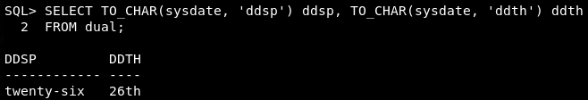
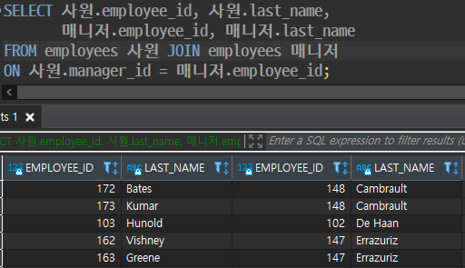
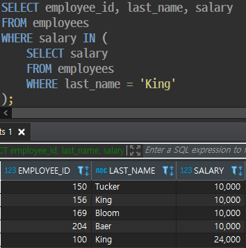

> 테이블 구조 조회

```mysql
DESCRIBE 테이블명
```

<br>

<br>

> 데이터 검색

```sql
SELECT *
FROM 테이블명 [alias] JOIN 테이블명 [alias]
ON 연결조건
WHERE 조건컬럼 연산자 조건값
GROUP BY 표현식
HAVING 그룹조건
ORDER BY 컬럼 [ASC|DESC];
```

<br>

> NULL

해당 컬럼에 데이터를 입력하지 않은 경우 입력되는 값

표현식의 연산내용에 NULL값을 포함한 컬럼이 있다면 연산식의 내용과는 상관없이 NULL값이 출력

<br>

> Column Alias

쿼리문 결과 출력 시 기존 컬럼명 대신 출력, 표현식(사칙연산기호를 활용한 계산식)에 사용 불가

1. 컬럼명 [AS] alias
2. 컬럼명 [AS] "Alias" → 대소문자 구분, 공백 포함, 특수문자 포함

 <br>

> 연결 연산자 

```sql
SELECT 컬럼1 || 컬럼2
FROM 테이블명;
```

<br>

> 리터럴 문자 

쿼리 구문에 포함된 일반 문자, 숫자, 날짜 값

항상 같은 값 출력

```sql
SELECT 컬럼1 || '리터럴 문자' || 컬럼2
FROM 테이블명;
```

<br>

<br>

> 중복 값 제거

컬럼 목록(`,`로 구분)이 오는 경우 컬럼 목록 값이 모두 일치한 경우에만 중복값 제거

SELECT 절의 첫번째 자리에 위치

```sql
SELECT DISTINCT 컬럼명
FROM 테이블명;
```

<br>

<br>

> 조건절 **WHERE**

출력을 원하는 행을 선택하는 조건을 명시

비교연산자 : =, >, <, >=, <=, !=

문자열값 비교 시 대소문자도 일치해야 출력

'일-월-년도' , 'DD-MM-YY' 형태의 문자열로 조건값을 주는 경우 날짜값으로 인식

<br>

**BETWEEN A AND B** : A 이상 B 이하

&nbsp;&nbsp;&nbsp;&nbsp;&nbsp;&nbsp;&nbsp;&nbsp;&nbsp;&nbsp;&nbsp;&nbsp;&nbsp;&nbsp;&nbsp;&nbsp;&nbsp;&nbsp;&nbsp;&nbsp;&nbsp;&nbsp;&nbsp;&nbsp;&nbsp;&nbsp;&nbsp;&nbsp;&nbsp;&nbsp;&nbsp;&nbsp;&nbsp;&nbsp;&nbsp;문자열, 날짜값 범위 연산 가능

<br>

**IN(조건값1, 조건값2, ..., 조건값n)** 

: 조건값과 동일한 값을 가지는 행을 선택

&nbsp;&nbsp;조건값을 목록으로 여러개를 받을 수 있음

<br>

**LIKE** : 패턴문자의 패턴을 가지는 문자열의 값을 가진 행 출력,

&nbsp;&nbsp;&nbsp;&nbsp;&nbsp;&nbsp;&nbsp;&nbsp;&nbsp;숫자, 날짜 데이터에도 사용 가능

&nbsp;&nbsp;&nbsp;&nbsp;&nbsp;&nbsp;&nbsp;&nbsp;&nbsp;&nbsp;**_**  한자리 문자

<br>

&nbsp;&nbsp;&nbsp;&nbsp;&nbsp;&nbsp;&nbsp;&nbsp;&nbsp;**%**  0~n자리 문자

<br>

**IS NULL** 컬럼값이 NULL인 행 선택

<br>

**a AND b** a, b 조건을 둘 다 만족

**a OR b** a, b 둘 중 하나 이상의 조건 만족

AND와 OR을 조합해서 사용하는 경우 **AND**가 **우선 연산** → **( )** 사용

<br>

**NOT** 다른 연산자와 조합하여 사용

&nbsp;&nbsp;&nbsp;&nbsp;&nbsp;&nbsp;&nbsp;&nbsp;연산식 내용과 반대되는 결과

<br>

<br>

<br>

> 정렬절 **ORDER BY**

오름차순(**ASC**), 내림차순(**DESC**)

정렬기준 여러개(`,`로 구분)인 경우, 정렬 후 결과에서 중복값에 대해 이후 순서의 정렬기준으로 결과를 추가로 정렬

<br>

<br>

---

<br>

> 단일 행 함수

행당 하나의 결과 반환

문자함수 / 숫자함수 / 날짜함수 / 변환함수 / 일반함수

<br>

> 문자 함수

문자열 스펠링 대소문자 구분

<br>

**WHERE절**에 함수를 사용한 경우 **조건**에만 영향, 출력 형태에는 영향 X

<br>

**SELECT절**에 함수를 사용한 경우 **출력 형태**에 영향

<br>

저장된 데이터 수정 X

<br>

> 문자 조작 함수

 **CONCAT**: 두 문자열을 하나로 연결하여 출력

<br>

**SUBSTR** : 문자열 일부 추출

&nbsp;&nbsp;&nbsp;&nbsp;&nbsp;&nbsp;&nbsp;&nbsp;&nbsp;&nbsp;&nbsp;&nbsp;&nbsp;&nbsp;&nbsp;&nbsp;&nbsp;SUBSTR('문자열', 시작 자리, 자를 문자 수)

&nbsp;&nbsp;&nbsp;&nbsp;&nbsp;&nbsp;&nbsp;&nbsp;&nbsp;&nbsp;&nbsp;&nbsp;&nbsp;&nbsp;&nbsp;&nbsp;&nbsp;자를 문자 수 생략 시 시작 자리 이후의 모든 문자열 추출 

<br>

<br>

**LENGTH** : 문자열의 길이를 숫자로 표시

<br>

**INSTR** : 문자열에서 특정 문자열이 위치한 자리값 리턴

&nbsp;&nbsp;&nbsp;&nbsp;&nbsp;&nbsp;&nbsp;&nbsp;&nbsp;&nbsp;&nbsp;&nbsp;&nbsp;&nbsp;없을 경우 숫자 0 리턴

<br>

**LPAD** : 일정 길이로 왼쪽 여백을 채워서 출력

&nbsp;&nbsp;&nbsp;&nbsp;&nbsp;&nbsp;&nbsp;&nbsp;&nbsp;&nbsp;&nbsp;&nbsp;&nbsp;&nbsp;LPAD('문자열', 출력할 길이, '여백 채울 문자')

<br>

**RPAD** : 일정 길이로 오른쪽 여백을 채워서 출력

&nbsp;&nbsp;&nbsp;&nbsp;&nbsp;&nbsp;&nbsp;&nbsp;&nbsp;&nbsp;&nbsp;&nbsp;&nbsp;&nbsp;RPAD('문자열', 출력할 길이, '여백 채울 문자')

<br>

**REPLACE** : 문자열의 특정 값을 찾아 다른 문자열로 치환

&nbsp;&nbsp;&nbsp;&nbsp;&nbsp;&nbsp;&nbsp;&nbsp;&nbsp;&nbsp;&nbsp;&nbsp;&nbsp;&nbsp;&nbsp;&nbsp;&nbsp;&nbsp;&nbsp;&nbsp;REPLACE('대상 문자열', '찾을 문자열', '바꿀 문자열')

<br>

**TRIM** : 문자열 바깥의 특정 값을 삭제

<br>

<br>

> 숫자 함수

**ROUND** : 지정 소수점 자릿수로 반올림

<br>

**TRUNC** : 지정 소수점 자릿수 미만 버림

<br>

**MOD** : 나머지 연산

<br>

<br>

> 날짜

**SYSDATE** : 현재 접속한 DB 서버의 날짜-시간값을 리턴

```sql
SELECT sysdate
FROM 테이블명;
```

<br>

> 날짜 산술연산 

하루 = **1**, 1시간 = **1/24**

문자열 형태의 날짜값은 산술 연산 불가

**날짜 + 숫자** : 날짜에 일 수를 더함

**날짜 - 숫자** : 날짜에서 일 수를 뺌

**날짜 + 숫자/24** : 날짜에 시간 수를 더함

**날짜 - 날짜** : 두 날짜간의 차이나는 일 수를 숫자로 돌려줌

<br>

<br>

<br>

<br>

> 날짜 함수

**MONTHS_BETWEEN** : 두 날짜 간의 개월 수 

&nbsp;&nbsp;&nbsp;&nbsp;&nbsp;&nbsp;&nbsp;&nbsp;&nbsp;&nbsp;&nbsp;&nbsp;&nbsp;&nbsp;&nbsp;&nbsp;&nbsp;&nbsp;&nbsp;&nbsp;&nbsp;&nbsp;&nbsp;&nbsp;&nbsp;&nbsp;&nbsp;&nbsp;&nbsp;&nbsp;&nbsp;&nbsp;&nbsp;&nbsp;&nbsp;뺄셈연산을 개월로 환산하여 출력되므로 순서 고려

<br>

**ADD_MONTHS** : 입력 날짜 기준, 개월 단위로 날짜 데이터를 반환 

<br>

**NEXT_DAY** : 입력 날짜 이후(입력 날짜 포함 X)로 오는 특정 요일의 날짜 데이터를 반환

<br>

**LAST_DAY** : 입력 날짜가 속한 월의 마지막 날 반환

<br>

**ROUND** : 날짜 반올림, **'MONTH'** / **'YEAR'**

<br>

**TRUNC** : 날짜 버림, **'MONTH'** / **'YEAR'**

<br>

<br>

> 변환 함수

**TO_CHAR** (DATE  → CHAR) : TO_CHAR(날짜,'형식 요소')

<br>

----------

날짜 형식 요소

**YYYY / YY** : 연도 숫자로 표시

**YEAR** :  연도 영어로 표시

**MM** : 월 2자리 숫자로 표시

**MONTH** : 월 3자 영어 약어로 표시

**DD** : 일 숫자로 표시

**DY** : 요일 3자 영어 약어로 표시

**DAY** : 요일 전체 이름 표시

<br>

<br>

시간 형식 요소

**HH24** : 시 24시간 표시

**HH / HH12** : 시 12시간 표시

**MI** :  분

**SS** : 초

<br>

<br>

리터럴 요소 

**"문자열"** : 형식문자가 아닌 문자열을 포함하여 출력

<br>

<br>

접미어

형식 문자의 뒤에 붙여서 수식하는 목적

**sp** 앞의 형식문자를 영문 스펠링으로 변환하여 출력 

**th** 앞의 형식문자를 서수 형식으로 변환하여 출력 

<br>

<br>

숫자값을 출력하는 형식문자의 대소문자 → 출력결과에 영향 X

접미어 sp / 영문자로 출력하는 형식문자 → 형식문자의 대소문자에 맞춰서 출력

<br>

<br>

접두어

**fm** (fill mode) : 정해진 자릿수의 출력 형식이 있는 경우 → 자릿값 용도의 0 제거하고 출력

<br>

<br>

> 변환 함수 

**TO_CHAR**  (NUMBER  → CHAR) : TO_CHAR(숫자,'형식 요소')

<br>

<br>

<br>

<br>

---

숫자 형식 요소

**9** : 숫자값을 문자열로 변환 

&nbsp;&nbsp;&nbsp;&nbsp;&nbsp;숫자값보다 형식문자의 길이가 더 긴 경우 여백

&nbsp;&nbsp;&nbsp;&nbsp;&nbsp;숫자값보다 형식문자의 길이가 더 짧은 경우 깨짐(#)

**0** : 숫자값보다 형식문자의 길이가 더 긴 경우 0으로 채워서 출력

**$** : 통화기호 '$' 포함하여 출력

**L** : DB 국가 설정의 통화 기호 포함하여 출력

**.** : 정밀도를 나타내는 소수점 위치 지정

&nbsp;&nbsp;&nbsp;&nbsp;숫자값보다 형식문자의 정밀도가 더 높은 경우 형식문자의 길이에 맞춰 소수점 자리에 0을 더 채움

&nbsp;&nbsp;&nbsp;&nbsp;숫자값보다 형식문자의 정밀도가 더 낮은 경우 형식문자의 길이에 맞춰 반올림 

**,** : 자리값 구분

&nbsp;&nbsp;&nbsp;길이에 맞춰서 쉼표 출력, 정해진 위치 따로 없음

<br>

> 변환 함수 

**TO_NUMBER**  (CHAR → NUMBER) : TO_NUMBER(문자열[,'형식 요소'])

<br>

문자열의 형태를 형식문자를 사용하여 숫자값을 뽑아냄

<br>

> 변환 함수

**TO_DATE**  (CHAR → DATE) : TO_DATE(문자열[,'형식 요소'])

<br>

날짜 형식이 있는 문자열을 날짜 데이터로 출력

날짜 기본 형식인 'DD-MON-YY'는 별도의 형식 요소 없이 변환 가능

시간값 포함 문자열도 변환 가능

<br>

> 일반 함수

**NVL** : **NVL(컬럼, NULL지정값)**

&nbsp;&nbsp;&nbsp;&nbsp;&nbsp;&nbsp;&nbsp;&nbsp;&nbsp;&nbsp;NULL 값을 지정값으로 대체, NULL이 아닌 값은 그대로 출력

&nbsp;&nbsp;&nbsp;&nbsp;&nbsp;&nbsp;&nbsp;&nbsp;&nbsp;&nbsp;날짜, 문자, 숫자 데이터 타입에 사용

&nbsp;&nbsp;&nbsp;&nbsp;&nbsp;&nbsp;&nbsp;&nbsp;&nbsp;&nbsp;데이터 타입이 일치해야함

<br>

**NVL2** : **NVL(컬럼, NULL이 아닐 때, NULL일 때)**

&nbsp;&nbsp;&nbsp;&nbsp;&nbsp;&nbsp;&nbsp;&nbsp;&nbsp;&nbsp;&nbsp;&nbsp;&nbsp;NULL 값의 여부에 따라서 출력값이 달라짐, NULL 직접 출력 X;

&nbsp;&nbsp;&nbsp;&nbsp;&nbsp;&nbsp;&nbsp;&nbsp;&nbsp;&nbsp;&nbsp;&nbsp;&nbsp;2, 3번째 인자 데이터 타입이 일치해야함

<br>

**NULLIF** : **NULLIF(입력값1, 입력값2)** 

&nbsp;&nbsp;&nbsp;&nbsp;&nbsp;&nbsp;&nbsp;&nbsp;&nbsp;&nbsp;&nbsp;&nbsp;&nbsp;&nbsp;&nbsp;&nbsp;&nbsp;두 입력값이 같은 경우 NULL 출력, 다른 경우 입력값1 출력

<br>

**COALESCE** : **COALESCE(입력값1, 입력값2, 입력값3)**

&nbsp;&nbsp;&nbsp;&nbsp;&nbsp;&nbsp;&nbsp;&nbsp;&nbsp;&nbsp;&nbsp;&nbsp;&nbsp;&nbsp;&nbsp;&nbsp;&nbsp;&nbsp;&nbsp;&nbsp;&nbsp;&nbsp;입력값 중 NULL이 아닌 첫번째 값 출력, 입력값들의 **데이터 타입이 같아야** 함

<br>

<br>

---

<br>

> 그룹 함수

그룹 단위로 연산, GROUP BY절을 사용하지 않은 경우 테이블의 모든 행이 하나의 그룹으로 취급됨

**NULL값을 제외**한 결과 연산

**COUNT** 함수는 *****를 사용해서 NULL 여부와 상관없이 행의 수 연산 가능

**DISTINCT** 키워드를 사용해서 중복값을 제거하고 연산 가능

- 숫자값 입력 받는 함수
  - **AVG**([DISTINCT|<u>ALL</u>] n) 평균
  - **STDDEV**([DISTINCT|<u>ALL</u>] n) 표준편차
  - **VARIANCE**([DISTINCT|<u>ALL</u>] n) 분산
  - **SUM**([DISTINCT|<u>ALL</u>] n) 합계

- 데이터타입 구분 없는 함수
  - **COUNT**(* | [DISTINCT|<u>ALL</u>] expr) 행 개수
  - **MAX**([DISTINCT|<u>ALL</u>] expr) 최대값
  - **MIN**([DISTINCT|<u>ALL</u>] expr) 최소값

<br>

<br><br>

> GROUP BY절

특정 컬럼에서 같은 값을 가지는 행끼리 묶어서 그룹을 만드는 옵션절

SELECT절에 그룹함수, GROUP BY절에 사용된 컬럼 사용 가능

GROUP BY절이 없으면  SELECT절에 그룹함수만 사용 가능

<br><br>

> HAVING절

GROUP BY절을 통해서 만들어진 그룹들에 대한 조건절

조건식을 만족하는 그룹만 결과로 출력됨

그룹함수의 연산결과로 조건 설정

<br><br>

---

<br>

> JOIN - ON절

테이블 정보를 연결하여 데이터 조회 → 하나의 테이블인것처럼 사용

SELECT절에서 출력할 컬럼을 지정할 때 **테이블명.컬럼명** 명시

→ JOIN한 모든 테이블에서 고유한 이름을 가진 경우 테이블명 생략 가능

<br>

<br><br>

>  SELF - JOIN

하나의 같은 테이블을 연결

Column Alias 반드시 명시

<br>

<br>

> 서브쿼리 Subquery

쿼리문 안에서 보조 역할을 하는 쿼리문

서브쿼리가 메인쿼리보다 먼저 실행되어 그 결과가 메인쿼리로 전달됨

IN 연산자는 여러개의 값을 목록으로 받을 수 있기 때문에 리턴값이 여러 행인 서브쿼리 사용 가능

<br>

<br><br>

> Inline View

서브쿼리를 활용하여 뷰의 역할을 대신함

<br><br>

---

<br>

> 데이터 조작어 DML

- **INSERT** : 테이블에 새로운 데이터 추가

  - INSERT INTO절 : 데이터가 입력 될 테이블과 컬럼의 목록 작성

  - VALUES절 : 테이블에 실제 입력 될 값의 목록 작성

  - INSERT INTO절에 명시된 컬럼 목록 순서에 맞

    VALUES절에 명시된 입력 값이 해당 컬럼에 순서대로 입력,

    명시되지 않은 컬럼의 경우 기본적으로 NULL값이 입력됨

  - VALUES절을 서브쿼리로 작성 시 

    서브쿼리 출력 값들이 테이블에 복사되어 입력됨

```sql
INSERT INTO 테이블명[(컬럼1[, 컬럼2, …])]
VALUES (데이터[, 데이터, …]);
```

<br>

<br><br>

- **UPDATE** : 테이블의 기존 데이터 갱신
  - UPDATE절 : 갱신할 데이터가 있는 테이블 지정
  - SET절 : 갱신할 컬럼과 값 지정
  - WHERE절 : 조건 명시, 생략시 테이블  모든 행 갱신

```sql
UPDATE 테이블명
SET 컬럼1 = 데이터, 컬럼2 = 데이터
[WHERE절];
```

<br>

<br>

- **DELETE** : 테이블의 기존 데이터 삭제
  - DELETE절 : 삭제할 데이터가 있는 테이블 지정
  - WHERE절 : 조건 명시, 생략시 테이블의 모든 행 삭제

```sql
DELETE [FROM] 테이블명
[WHERE절];
```

<br>

<br>

<br>

> 트랜잭션

논리적인 작업 단위

구성 : 여러 DML 구문 / 하나의 DDL 구문 / 하나의 DCL 구문

시작 : 첫번째 DML 구문 실행시

종료 :

- COMMT / ROLLBACK 실행 시

- DDL / DCL 구문 실행시 → 자동 커밋

  주의) 이전에 진행 중이던 트랜잭션이 있으면 같이 커밋됨

- SQL *PLUS 정상 종료시 → 자동 커밋

- 시스템 장애시 → 자동 롤백

<br>

> TCL 

트랜잭션을 제어하는 명령어

- **COMMIT** : 진행 중인 트랜잭션을 데이터베이스에 기록 후 종료

- **ROLLBACK** : 

  진행 중인 트랜잭션을 취소 후 종료

  세이브포인트명 생략시 전체 취소

- **SAVEPOINT** : 진행 중인 트랜잭션에서 돌아 갈 수 있는 지점 생성

```sql
SAVEPOINT 세이브포인트명;
ROLLBACK [TO SAVEPOINT 세이브포인트명];
COMMIT;
```

<br>

---

<br>

> 데이터 정의어 DDL

데이터베이스의 구조(오브젝트), 설정을 정의

- **CREATE** : 오브젝트 생성
- **ALTER** : 오브젝트 변형
- **DROP** : 오브젝트 삭제
- **TRUNCATE** : 테이블 절단
- **RENAME** : 오브젝트 이름 변경

오브젝트 종류

- 테이블 Table : 데이터의 기본 저장 단위, 행으로 구성
- 뷰 View : 하나 이상의 테이블들의 논리적인 부분 집합
- 시퀀스 Sequence : 숫자값 생성
- 인덱스 Index : 일부 쿼리 구문 성능 향상
- 시노님 Synonym : 오브젝트에 추가적인 이름(별명) 부여

<br>

> 테이블 Table

필수 요소 : 테이블명, 컬럼명, 컬럼 데이터타입, 컬럼 크기

옵션 : DEFAULT, 제약조건

```sql
CREATE TABLE 테이블명 (
	컬럼명	      	  데이터타입(컬럼사이즈),
	deptno	    	NUMBER(2),
	dname	    	VARCHAR2(14),
	create_date 	DATE [DEFAULT] SYSDATE
);
```

제약조건 : 

테이블의 데이터에 정확한 데이터가 들어가도록 정하는 규칙

제약조건명은 제약조건을 관리하는 목적으로 사용

제약조건명을 생략한 경우 DB에서 임의 생성

테이블명＿컬럼명＿제약조건종류 형태로 작성

동일한 스키마 범위 내에서 중복값으로 만들 수 없음

- **NOT NULL** : NULL값을 입력할 수 없음, 컬럼 레벨

- **UNIQUE** : 중복값을 허용하지 않음

- **PRIMARY KEY** 

  테이블 당 한번만 사용 가능 → 테이블을 대표하는 컬럼에 설정 

  NOT NULL, UNIQUE 성질을 가짐

- **FOREIGN KEY** 

  자신의 테이블/다른 테이블의 특정 컬럼(PK, UK) 참조 

  → 조인의 조건으로 활용

  외래키가 설정되는 컬럼의 값은 

  외래키가 참조하는 컬럼의 값의 범위에서 데이터를 선택하여 입력 가능

- **CHECK** 

  특정 컬럼에 대해서 작성한 조건값에 맞는 값만 입력을 허용

  기존 WHERE절에서 사용했던 조건식 사용 가능

  하나의 컬럼으로 PK 특성을 만족하지 못하는 경우 

  → 여러 컬럼을 묶어서 제약조건 설정 가능

  → 참조하는 쪽도 같은 조합(데이터타입, 크기, 순서)으로 값을 받아와야 함 

```sql
CREATE TABLE test3(
    id 	 	   NUMBER(10)	 CONSTRAINT t3_id_pk PRIMARY KEY,
    name  	   VARCHAR2(30)	 CONSTRAINT t3_name_nn NOT NULL, 
    job  	   VARCHAR2(20),
    email 	   VARCHAR2(20),
    phone	   VARCHAR2(20)  CONSTRAINT t3_ph_nn NOT NULL
    					     CONSTRAINT t3_ph_uk UNIQUE, 
    start_date DATE,
    CONSTRAINT t2_email_uk UNIQUE(email) 
);
```

```sql
-- 제약조건 조회 (UNIQUE 조회 불가)
DESC user_constraints

-- 테이블명 대문자로 조회
SELECT constraint_name, constraint_type, search_condition, r_constraint_name
FROM user_constraints
WHERE table_name = 'TEST3';
```

<br>

```sql
-- FK 
-- REFERENCES 참조테이블명(참조컬럼명)

-- 테이블 레벨
CREATE TABLE employees(
	...
	department_id	NUMBER(4),
	CONSTRAINT emp_dept_fk FOREIGN KEY(department_id)
						   REFERENCES departments(department_id)
);

-- 컬럼 레벨
CREATE TABLE employees(
    ...
    department_id NUMBER(4) CONSTRAINT emp_deptid_fk
    						REFERENCES departments(department_id),
    ...
);
```

서브쿼리를 사용한 테이블 생성

- 복사된 테이블의 일부 제약조건이 복사되어 생성됨
- 복사된 제약조건 이름은 DB에서 자동 생성됨 (제약조건 이름은 고유해야함)

```sql
CREATE TABLE dept80
	AS
		SELECT employee_id, last_name, salary*12 ANNSAL, hire_date
		FROM employees
		WHERE 1 = 2;
		-- 데이터 없이 테이블 구조만 복사하고 싶을 때
		-- 항상 거짓이 되는 조건식 사용
```


<br>

