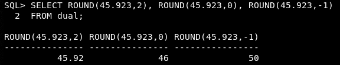
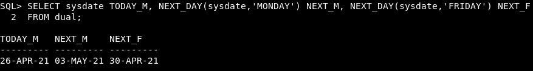

> 테이블 구조 조회

```mysql
DESCRIBE 테이블명
```

<br>

<br>

> 데이터 검색

```sql
SELECT *
FROM 테이블명
WHERE 조건컬럼 연산자 조건값
ORDER BY 컬럼 [ASC|DESC];
```

<br>

> NULL

해당 컬럼에 데이터를 입력하지 않은 경우 입력되는 값

표현식의 연산내용에 NULL값을 포함한 컬럼이 있다면 연산식의 내용과는 상관없이 NULL값이 출력

<br>

> Column Alias

쿼리문 결과 출력 시 기존 컬럼명 대신 출력, 표현식(사칙연산기호를 활용한 계산식)에 사용 불가

1. 컬럼명 [AS] alias
2. 컬럼명 [AS] "Alias" → 대소문자 구분, 공백 포함, 특수문자 포함

 <br>

> 연결 연산자 

```sql
SELECT 컬럼1 || 컬럼2
FROM 테이블명;
```

<br>

> 리터럴 문자 

쿼리 구문에 포함된 일반 문자, 숫자, 날짜 값

항상 같은 값 출력

```sql
SELECT 컬럼1 || '리터럴 문자' || 컬럼2
FROM 테이블명;
```

<br>

<br>

> 중복 값 제거

컬럼 목록(`,`로 구분)이 오는 경우 컬럼 목록 값이 모두 일치한 경우에만 중복값 제거

SELECT 절의 첫번째 자리에 위치

```sql
SELECT DISTINCT 컬럼명
FROM 테이블명;
```

<br>

<br>

> 조건절 **WHERE**

출력을 원하는 행을 선택하는 조건을 명시

비교연산자 : =, >, <, >=, <=, !=

문자열값 비교 시 대소문자도 일치해야 출력

'일-월-년도' , 'DD-MM-YY' 형태의 문자열로 조건값을 주는 경우 날짜값으로 인식

<br>

**BETWEEN A AND B** : A 이상 B 이하

&nbsp;&nbsp;&nbsp;&nbsp;&nbsp;&nbsp;&nbsp;&nbsp;&nbsp;&nbsp;&nbsp;&nbsp;&nbsp;&nbsp;&nbsp;&nbsp;&nbsp;&nbsp;&nbsp;&nbsp;&nbsp;&nbsp;&nbsp;&nbsp;&nbsp;&nbsp;&nbsp;&nbsp;&nbsp;&nbsp;&nbsp;&nbsp;&nbsp;&nbsp;&nbsp;문자열, 날짜값 범위 연산 가능

<br>

**IN(조건값1, 조건값2, ..., 조건값n)** 

: 조건값과 동일한 값을 가지는 행을 선택

&nbsp;&nbsp;조건값을 목록으로 여러개를 받을 수 있음

<br>

**LIKE** : 패턴문자의 패턴을 가지는 문자열의 값을 가진 행 출력,

&nbsp;&nbsp;&nbsp;&nbsp;&nbsp;&nbsp;&nbsp;&nbsp;&nbsp;숫자, 날짜 데이터에도 사용 가능

&nbsp;&nbsp;&nbsp;&nbsp;&nbsp;&nbsp;&nbsp;&nbsp;&nbsp;&nbsp;**_**  한자리 문자

<br>

&nbsp;&nbsp;&nbsp;&nbsp;&nbsp;&nbsp;&nbsp;&nbsp;&nbsp;**%**  0~n자리 문자

<br>

**IS NULL** 컬럼값이 NULL인 행 선택

<br>

**a AND b** a, b 조건을 둘 다 만족

**a OR b** a, b 둘 중 하나 이상의 조건 만족

AND와 OR을 조합해서 사용하는 경우 **AND**가 **우선 연산** → **( )** 사용

<br>

**NOT** 다른 연산자와 조합하여 사용

&nbsp;&nbsp;&nbsp;&nbsp;&nbsp;&nbsp;&nbsp;&nbsp;연산식 내용과 반대되는 결과

<br>

<br>

<br>

> 정렬절 **ORDER BY**

오름차순(**ASC**), 내림차순(**DESC**)

정렬기준 여러개(`,`로 구분)인 경우, 정렬 후 결과에서 중복값에 대해 이후 순서의 정렬기준으로 결과를 추가로 정렬

<br>

<br>

> 단일 행 함수

행당 하나의 결과 반환

문자함수 / 숫자함수 / 날짜함수 / 변환함수 / 일반함수

<br>

> 문자 함수

문자열 스펠링 대소문자 구분

<br>

**WHERE절**에 함수를 사용한 경우 **조건**에만 영향, 출력 형태에는 영향 X

<br>

**SELECT절**에 함수를 사용한 경우 **출력 형태**에 영향

<br>

저장된 데이터 수정 X

<br>

> 문자 조작 함수

 **CONCAT**: 두 문자열을 하나로 연결하여 출력

<br>

**SUBSTR** : 문자열 일부 추출

&nbsp;&nbsp;&nbsp;&nbsp;&nbsp;&nbsp;&nbsp;&nbsp;&nbsp;&nbsp;&nbsp;&nbsp;&nbsp;&nbsp;&nbsp;&nbsp;&nbsp;SUBSTR('문자열', 시작 자리, 자를 문자 수)

&nbsp;&nbsp;&nbsp;&nbsp;&nbsp;&nbsp;&nbsp;&nbsp;&nbsp;&nbsp;&nbsp;&nbsp;&nbsp;&nbsp;&nbsp;&nbsp;&nbsp;자를 문자 수 생략 시 시작 자리 이후의 모든 문자열 추출 

<br>

<br>

**LENGTH** : 문자열의 길이를 숫자로 표시

<br>

**INSTR** : 문자열에서 특정 문자열이 위치한 자리값 리턴

&nbsp;&nbsp;&nbsp;&nbsp;&nbsp;&nbsp;&nbsp;&nbsp;&nbsp;&nbsp;&nbsp;&nbsp;&nbsp;&nbsp;없을 경우 숫자 0 리턴

<br>

**LPAD** : 일정 길이로 왼쪽 여백을 채워서 출력

&nbsp;&nbsp;&nbsp;&nbsp;&nbsp;&nbsp;&nbsp;&nbsp;&nbsp;&nbsp;&nbsp;&nbsp;&nbsp;&nbsp;LPAD('문자열', 출력할 길이, '여백 채울 문자')

<br>

**RPAD** : 일정 길이로 오른쪽 여백을 채워서 출력

&nbsp;&nbsp;&nbsp;&nbsp;&nbsp;&nbsp;&nbsp;&nbsp;&nbsp;&nbsp;&nbsp;&nbsp;&nbsp;&nbsp;RPAD('문자열', 출력할 길이, '여백 채울 문자')

<br>

**REPLACE** : 문자열의 특정 값을 찾아 다른 문자열로 치환

&nbsp;&nbsp;&nbsp;&nbsp;&nbsp;&nbsp;&nbsp;&nbsp;&nbsp;&nbsp;&nbsp;&nbsp;&nbsp;&nbsp;&nbsp;&nbsp;&nbsp;&nbsp;&nbsp;&nbsp;REPLACE('대상 문자열', '찾을 문자열', '바꿀 문자열')

<br>

**TRIM** : 문자열 바깥의 특정 값을 삭제

<br>

<br>

> 숫자 함수

**ROUND** : 지정 소수점 자릿수로 반올림

<br>

**TRUNC** : 지정 소수점 자릿수 미만 버림

<br>

**MOD** : 나머지 연산

<br>

<br>

> 날짜

**SYSDATE** : 현재 접속한 DB 서버의 날짜-시간값을 리턴

```sql
SELECT sysdate
FROM 테이블명;
```

<br>

> 날짜 산술연산 

하루 = **1**, 1시간 = **1/24**

문자열 형태의 날짜값은 산술 연산 불가

**날짜 + 숫자** : 날짜에 일 수를 더함

**날짜 - 숫자** : 날짜에서 일 수를 뺌

**날짜 + 숫자/24** : 날짜에 시간 수를 더함

**날짜 - 날짜** : 두 날짜간의 차이나는 일 수를 숫자로 돌려줌

<br>

<br>

<br>

<br>

> 날짜 함수

**MONTHS_BETWEEN** : 두 날짜 간의 개월 수 

&nbsp;&nbsp;&nbsp;&nbsp;&nbsp;&nbsp;&nbsp;&nbsp;&nbsp;&nbsp;&nbsp;&nbsp;&nbsp;&nbsp;&nbsp;&nbsp;&nbsp;&nbsp;&nbsp;&nbsp;&nbsp;&nbsp;&nbsp;&nbsp;&nbsp;&nbsp;&nbsp;&nbsp;&nbsp;&nbsp;&nbsp;&nbsp;&nbsp;&nbsp;&nbsp;뺄셈연산을 개월로 환산하여 출력되므로 순서 고려

<br>

**ADD_MONTHS** : 입력 날짜 기준, 개월 단위로 날짜 데이터를 반환 

<br>

**NEXT_DAY** : 입력 날짜 이후(입력 날짜 포함 X)로 오는 특정 요일의 날짜 데이터를 반환

<br>

**LAST_DAY** : 입력 날짜가 속한 월의 마지막 날 반환

<br>

**ROUND** : 날짜 반올림, **'MONTH'** / **'YEAR'**

<br>

**TRUNC** : 날짜 버림, **'MONTH'** / **'YEAR'**

<br>

<br>

> 변환 함수

**TO_CHAR** (DATE  → CHAR) : TO_CHAR(날짜,'형식 요소')

<br>

----------

날짜 형식 요소

**YYYY / YY** : 연도 숫자로 표시

**YEAR** :  연도 영어로 표시

**MM** : 월 2자리 숫자로 표시

**MONTH** : 월 3자 영어 약어로 표시

**DD** : 일 숫자로 표시

**DY** : 요일 3자 영어 약어로 표시

**DAY** : 요일 전체 이름 표시

<br>

<br>

시간 형식 요소

**HH24** : 시 24시간 표시

**HH / HH12** : 시 12시간 표시

**MI** :  분

**SS** : 초

<br>

<br>

리터럴 요소 

**"문자열"** : 형식문자가 아닌 문자열을 포함하여 출력

<br>

<br>

접미어

형식 문자의 뒤에 붙여서 수식하는 목적

**sp** 앞의 형식문자를 영문 스펠링으로 변환하여 출력 

**th** 앞의 형식문자를 서수 형식으로 변환하여 출력 

<br>

<br>

숫자값을 출력하는 형식문자의 대소문자 → 출력결과에 영향 X

접미어 sp / 영문자로 출력하는 형식문자 → 형식문자의 대소문자에 맞춰서 출력

<br>

<br>

접두어

**fm** (fill mode) : 정해진 자릿수의 출력 형식이 있는 경우 → 자릿값 용도의 0 제거하고 출력

<br>

<br>

> 변환 함수 

**TO_CHAR**  (NUMBER  → CHAR) : TO_CHAR(숫자,'형식 요소')

<br>

<br>

<br>

<br>

---

숫자 형식 요소

**9** : 숫자값을 문자열로 변환 

&nbsp;&nbsp;&nbsp;&nbsp;&nbsp;숫자값보다 형식문자의 길이가 더 긴 경우 여백

&nbsp;&nbsp;&nbsp;&nbsp;&nbsp;숫자값보다 형식문자의 길이가 더 짧은 경우 깨짐(#)

**0** : 숫자값보다 형식문자의 길이가 더 긴 경우 0으로 채워서 출력

**$** : 통화기호 '$' 포함하여 출력

**L** : DB 국가 설정의 통화 기호 포함하여 출력

**.** : 정밀도를 나타내는 소수점 위치 지정

&nbsp;&nbsp;&nbsp;&nbsp;숫자값보다 형식문자의 정밀도가 더 높은 경우 형식문자의 길이에 맞춰 소수점 자리에 0을 더 채움

&nbsp;&nbsp;&nbsp;&nbsp;숫자값보다 형식문자의 정밀도가 더 낮은 경우 형식문자의 길이에 맞춰 반올림 

**,** : 자리값 구분

&nbsp;&nbsp;&nbsp;길이에 맞춰서 쉼표 출력, 정해진 위치 따로 없음

<br>

> 변환 함수 

**TO_NUMBER**  (CHAR → NUMBER) : TO_NUMBER(문자열[,'형식 요소'])

<br>

문자열의 형태를 형식문자를 사용하여 숫자값을 뽑아냄

<br>

> 변환 함수

**TO_DATE**  (CHAR → DATE) : TO_DATE(문자열[,'형식 요소'])

<br>

날짜 형식이 있는 문자열을 날짜 데이터로 출력

날짜 기본 형식인 'DD-MON-YY'는 별도의 형식 요소 없이 변환 가능

시간값 포함 문자열도 변환 가능

<br>

> 일반 함수

**NVL** : **NVL(컬럼, null지정값)**

&nbsp;&nbsp;&nbsp;&nbsp;&nbsp;&nbsp;&nbsp;&nbsp;&nbsp;&nbsp;null 값을 지정값으로 대체, null이 아닌 값은 그대로 출력

&nbsp;&nbsp;&nbsp;&nbsp;&nbsp;&nbsp;&nbsp;&nbsp;&nbsp;&nbsp;날짜, 문자, 숫자 데이터 타입에 사용

&nbsp;&nbsp;&nbsp;&nbsp;&nbsp;&nbsp;&nbsp;&nbsp;&nbsp;&nbsp;데이터 타입이 일치해야함

<br>

**NVL2** : **NVL(컬럼, null이 아닐 때, null일 때)**

&nbsp;&nbsp;&nbsp;&nbsp;&nbsp;&nbsp;&nbsp;&nbsp;&nbsp;&nbsp;&nbsp;&nbsp;&nbsp;null 값의 여부에 따라서 출력값이 달라짐, null 직접 출력 X

&nbsp;&nbsp;&nbsp;&nbsp;&nbsp;&nbsp;&nbsp;&nbsp;&nbsp;&nbsp;&nbsp;&nbsp;&nbsp;2, 3번째 인자 데이터 타입이 일치해야함

<br>


