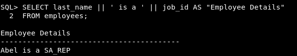

> 테이블 구조 조회

```mysql
DESCRIBE 테이블명
```


<br>

> 데이터 검색

```sql
SELECT *
FROM 테이블명
WHERE 조건컬럼 연산자 조건값
ORDER BY 컬럼 [ASC|DESC];
```

<br>

> NULL

해당 컬럼에 데이터를 입력하지 않은 경우 입력되는 값

표현식의 연산내용에 NULL값을 포함한 컬럼이 있다면 연산식의 내용과는 상관없이 NULL값이 출력

<br>

> Column Alias

쿼리문 결과 출력 시 기존 컬럼명 대신 출력, 표현식(사칙연산기호를 활용한 계산식)에 사용 불가

1. 컬럼명 [AS] alias
2. 컬럼명 [AS] "Alias" → 대소문자 구분, 공백 포함, 특수문자 포함

 <br>

> 연결 연산자 

```sql
SELECT 컬럼1 || 컬럼2
FROM 테이블명;
```

<br>

> 리터럴 문자 

쿼리 구문에 포함된 일반 문자, 숫자, 날짜 값

항상 같은 값 출력

```sql
SELECT 컬럼1 || '리터럴 문자' || 컬럼2
FROM 테이블명;
```



<br>

> 중복 값 제거

컬럼 목록(`,`로 구분)이 오는 경우 컬럼 목록 값이 모두 일치한 경우에만 중복값 제거

SELECT 절의 첫번째 자리에 위치

```sql
SELECT DISTINCT 컬럼명
FROM 테이블명;
```


<br>

> 조건절 **WHERE**

출력을 원하는 행을 선택하는 조건을 명시

비교연산자 : =, >, <, >=, <=, !=

문자열값 비교 시 대소문자도 일치해야 출력

'일-월-년도' , 'DD-MM-YY' 형태의 문자열로 조건값을 주는 경우 날짜값으로 인식


**BETWEEN A AND B** : A 이상 B 이하

&nbsp;&nbsp;&nbsp;&nbsp;&nbsp;&nbsp;&nbsp;&nbsp;&nbsp;&nbsp;&nbsp;&nbsp;&nbsp;&nbsp;&nbsp;&nbsp;&nbsp;&nbsp;&nbsp;&nbsp;&nbsp;&nbsp;&nbsp;&nbsp;&nbsp;&nbsp;&nbsp;&nbsp;&nbsp;&nbsp;&nbsp;&nbsp;&nbsp;&nbsp;&nbsp;&nbsp;&nbsp;문자열, 날짜값 범위 연산 가능


**IN(조건값1, 조건값2, ..., 조건값n)** 

: 조건값과 동일한 값을 가지는 행을 선택

&nbsp;&nbsp;조건값을 목록으로 여러개를 받을 수 있음


**LIKE** : 패턴문자의 패턴을 가지는 문자열의 값을 가진 행 출력,

&nbsp;&nbsp;&nbsp;&nbsp;&nbsp;&nbsp;&nbsp;&nbsp;&nbsp;&nbsp;&nbsp;숫자, 날짜 데이터에도 사용 가능

&nbsp;&nbsp;&nbsp;&nbsp;&nbsp;&nbsp;&nbsp;&nbsp;&nbsp;&nbsp;&nbsp;&nbsp;**_**  한자리 문자


&nbsp;&nbsp;&nbsp;&nbsp;&nbsp;&nbsp;&nbsp;&nbsp;&nbsp;&nbsp;&nbsp;**%**  0~n자리 문자


**IS NULL** 컬럼값이 NULL인 행 선택


**a AND b** a, b 조건을 둘 다 만족

**a OR b** a, b 둘 중 하나 이상의 조건 만족

AND와 OR을 조합해서 사용하는 경우 **AND**가 **우선 연산** → **( )** 사용

**NOT** 다른 연산자와 조합하여 사용

<br>

> 정렬절 **ORDER BY**

오름차순(**ASC**), 내림차순(**DESC**)

정렬기준 여러개(`,`로 구분)인 경우, 정렬 후 결과에서 중복값에 대해 이후 순서의 정렬기준으로 결과를 추가로 정렬

<br>


> 날짜

```sql
SELECT sysdate
FROM 테이블명;
```

<br>

> 날짜 산술연산 

하루 = **1**, 1시간 = **1/24**

문자열 형태의 날짜값은 산술 연산 불가

**날짜 + 숫자** : 날짜에 일 수를 더함

**날짜 - 숫자** : 날짜에서 일 수를 뺌

**날짜 + 숫자/24** : 날짜에 시간 수를 더함

**날짜 - 날짜** : 두 날짜간의 차이나는 일 수를 숫자로 돌려줌


<br>

> 날짜함수

**MONTHS_BETWEEN** : 두 날짜 간의 개월 수 

&nbsp;&nbsp;&nbsp;&nbsp;&nbsp;&nbsp;&nbsp;&nbsp;&nbsp;&nbsp;&nbsp;&nbsp;&nbsp;&nbsp;&nbsp;&nbsp;&nbsp;&nbsp;&nbsp;&nbsp;&nbsp;&nbsp;&nbsp;&nbsp;&nbsp;&nbsp;&nbsp;&nbsp;&nbsp;&nbsp;&nbsp;&nbsp;&nbsp;&nbsp;&nbsp;&nbsp;&nbsp;&nbsp;&nbsp;&nbsp;뺄셈연산을 개월로 환산하여 출력되므로 순서 고려


**ADD_MONTHS** : 입력 날짜 기준, 개월 단위로 날짜 데이터를 반환 


**NEXT_DAY** : 입력 날짜 이후로 오는 특정 요일의 날짜 데이터를 반환


**LAST_DAY** : 입력 날짜가 속한 월의 마지막 날 반환


**ROUND** : 날짜 반올림, **'MONTH'** / **'YEAR'**


**TRUNC** : 날짜 버림, **'MONTH'** / **'YEAR'**


<br>


